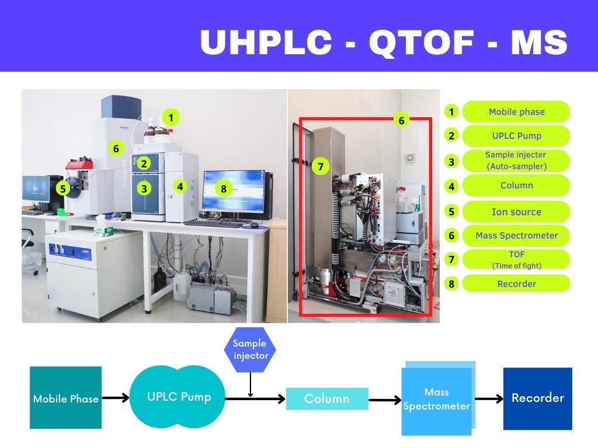

# Data acquisition
data acquisition of NMR และ LC-MS 

## Table of Contents
1. [NMR](#nmr)
2. [LC-MS](#lcms)

## Data acquisition - NMR 
Some text here

---
[↥ **Back to top**](#top)

## Data acquisition - LC-MS 
Some text here

---
[↥ **Back to top**](#top)
