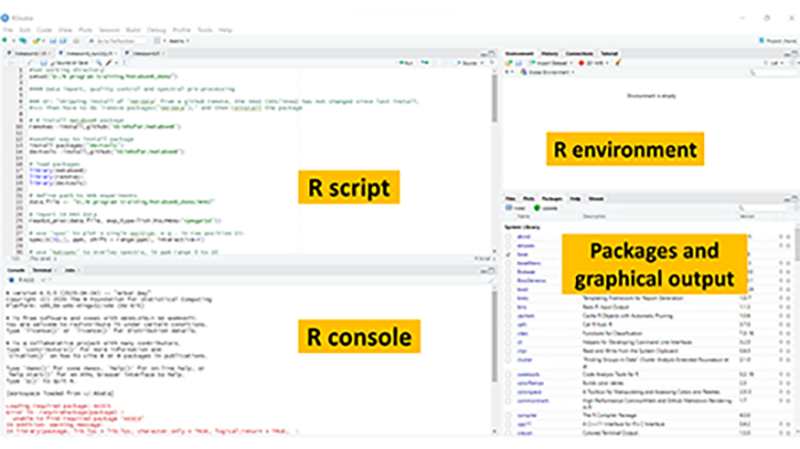
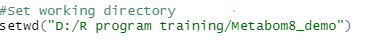

# Data pre-processing 
Before performing statistical analysis, data pre-processing is a very crucial step following data acquisition. This is to ensure the good quality of spectral data that may need some corrections in baseline and alignment. Missing data need to be reimputed. Normalisation may also be required for some datasets.

## Table of Contents
1. [NMR data pre-processing](#nmr)
2. [LC-MS data pre-processing](#lcms)

## NMR data pre-processing 
### Step 1. Open R studio program 

### Step 2. Set working directory 

### Step 3. Load library packages including metabom8, remotes and devtools
### Step 4. Define path to NMR experiment
### Step 5. Import NMR data
### Step 6. Plot single spectrum

---
[↥ **Back to top**](#top)

## LC-MS data pre-processing 
Some text here

---
[↥ **Back to top**](#top)
