# Data pre-processing 
Before performing statistical analysis, data pre-processing is a very crucial step following data acquisition. This is to ensure the good quality of spectral data that may need some corrections in baseline and alignment. Missing data need to be reimputed. Normalisation may also be required for some datasets.

## Table of Contents
1. [NMR data pre-processing](#nmr)
2. [LC-MS data pre-processing](#lcms)

## NMR data pre-processing <a name="nmr"></a>
### Step 1. Open R studio program 


### Step 2. Set working directory 

```
#set working directory 

setwd("D:/CliNaP-M/Metabom8")
```


### Step 3. Load library packages including metabom8, remotes and devtools

```
# load packages

library(metabom8)
library(remotes)
library(devtools)
```

### Step 4. Define path to NMR experiment

```
# define path to NMR experiments

data.file <- ""D:/CliNaP-M/Metabom8/NMR"
```

### Step 5. Import NMR data

```
# import 1D MRS data

read1d_proc(data.file, exp_type=list(PULPROG='cpmgpr1d'))
```

### Step 6. Plot single spectrum

```
# use 'spec' to plot a single pectrum, e.g., in row position 15:

spec(X[15,], ppm, shift = range(ppm), interactive=F)
```
**You will obtain the result below**


### Step 7. Plot overlay spectra 

```
# use 'matspec' to overlay spectra, in ppm range 0 to 10

matspec(X, ppm, shift = c(-1, 10), interactive=F)
```
**You will obtain the result below**

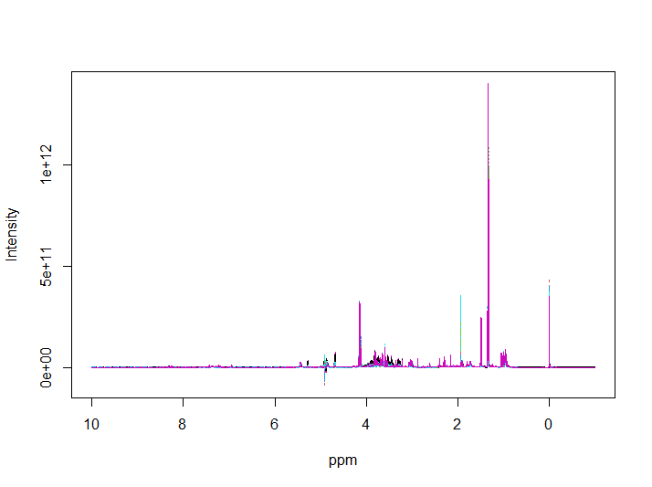

### Step 8. Create run order
```
# create run-order based on acquisition date

meta$runOrder=rank(as.POSIXct(meta$a_DATE))
```

### Step 9. Plot TSP signal
```
# plot TSP signal

specOverlay(X, ppm, shift=c(-0.05,0.05),
            an=list( 'Facet'=meta$a_EXP, # facet
                     'RunOrder'=meta$runOrder, # colour
                     'Pulse Program'=meta$a_PULPROG) # linetype
) # linetype
```
**You will obtain the result below**


### Step 10.  Perform TSP calibration

- **TSP calibration**
```
# perform TSP calibration

X_cal=calibrate(X, ppm, type='tsp')
```

- **Plot TSP after calibration**
```
# plot TSP after calibration

matspec(X_cal, ppm, shift=c(-0.1,0.1), interactive=F)
```

**You will obtain the result below** 

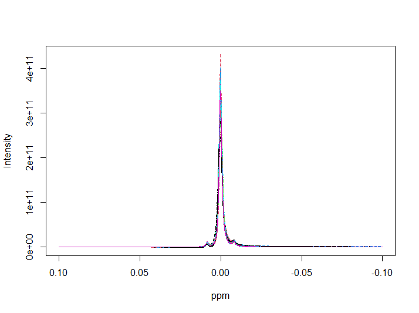

### Step 11. Calculate quality control measures in water region, low field and up field
```
# calculate quality control measures

matspec(X_cal, ppm, shift=c(4.5,5), interactive=F, main='Residual Water')
matspec(X_cal, ppm, shift=c(9,11), interactive=F, main='LowField Cap')
matspec(X_cal, ppm, shift=c(-1,1), interactive=F, main='UpField Cap')
```
**You will obtain the result below**

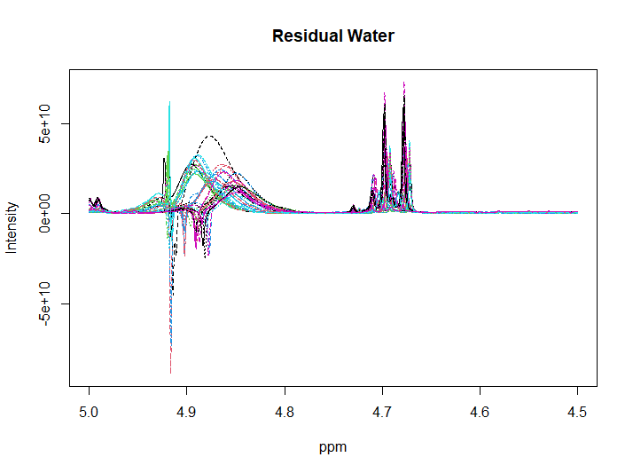

The NMR spectra for water region


The NMR spectra for low field


The NMR spectra for up field

### Step 12. Cut unwanted region including TSP, water and noise
#### 12.1 TSP region
- **Check TSP region**
```
#Check TSP region

matspec(X, ppm, shift = c(-0.05, 0.05), interactive=F)
```

**You will obtain the result below**

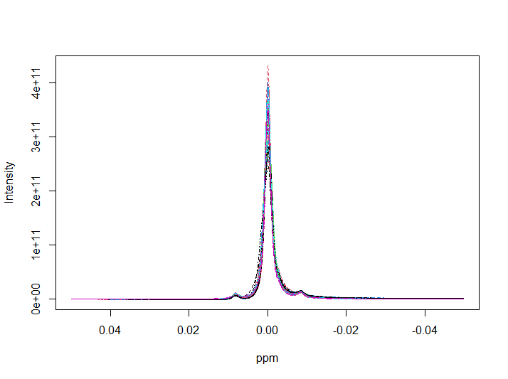

- **Specify TSP region to be removed** 
```
#Specify TSP region to be removed

idx_tsp=get_idx(range=c(min(ppm), 0.5), ppm)
```

#### 12.2 Water region
- **Check water region** 
```
#Check water region

matspec(X, ppm, shift = c(4.75, 5), interactive=F)
```

**You will obtain the result below**


- **Specify water region to be removed**
```
#Specify water region to be removed

idx_water=get_idx(range=c(4.75, 4.98), ppm)
```

#### 12.3 Down field noise region (ppm 9-10) 
- **Check down field noise region**
```
#Check downfield noise region

matspec(X, ppm, shift = c(8, 10), interactive=F)
```

**You will obtain the result below**

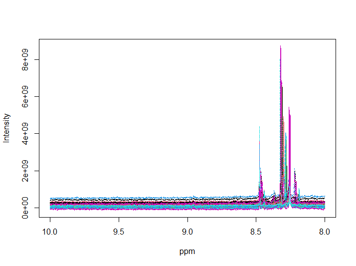

- **Specify downfield noise to be removed**
```
#Specify downfield noise to be removed

idx_noise=get.idx(range=c(9, max(ppm)), ppm)
```

#### 12.4 Gather all regions to be removed and excision of TSP, water and noise regions
```
#Gather all regions to be removed

idx_rm=c(idx_tsp, idx_water, idx_noise)

# Exision of TSP, res. water and noise regions

X_cut=X_cal[,-idx_rm]
ppm=ppm[-idx_rm]
```

### Step 13. Baseline correction
```
# Baseline correction

X_bl=bcor(X_cut)
```
**Visual assessment**
```
# visual assessment

Xcompare=rbind(X_bl[1,], X_cut[1,])
matspec(Xcompare, ppm, shift = c(7, 9), interactive=F)
matspec(Xcompare, ppm, shift = c(3,4), interactive=F)
```
**You will obtain the result below**

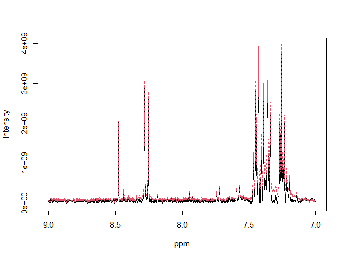


The red dash line represents the uncorrected baseline, the black line represents the baseline correction spectrum. 


### Step 14. Normalisation with PQN method 
```
# PQN normalisation

X_pqn=pqn(X_bl, add_DilF = 'NULL')
```

### Step 15. Visual inspection of the pre-processed NMR spectra

```
#The visual inspection of the pre-processed NMR spectra:
matspec(X_pqn, ppm, shift = range(ppm), interactive=F)                                 
matspec(X_pqn, ppm, shift = c(1.2, 1.7), interactive=F)
```

**You will obtain the result below**


The pre-processed NMR spectra at ppm 1-9.


The pre-processed NMR spectra at ppm 1.2-1.7.

### Step 16. Export NMR spectra to data table
#### 16.1 Transpose data of x_pqn and ppm

```
#Transpose NMR data to create csv file

x_pqn2 <- t(x_pqn)
ppm2 <- t(ppm)
```

#### 16.2 Export NMR data to .csv file 

```
#Export NMR data to .csv file

write.table(X_pqn2, file = "x_pqn2", quote = FALSE, sep = ", ",
            eol = "\n", na = "NA", dec = ".", row.names = FALSE,
            col.names = TRUE, qmethod = c("escape", "double"),
            fileEncoding = "")

write.table(ppm3, file = "ppm3", quote = FALSE, sep = " ,",
            eol = "\n", na = "NA", dec = ".", row.names = FALSE,
            col.names = TRUE, qmethod = c("escape", "double"),
            fileEncoding = "")
 ```

#### 16.3 Open csv file in excel to rearrange the format file for multivariate analysis


### Step 17. Save R workspace 


---
[↥ **Back to top**](#top)
## The Galaxy environment <a name="lcms"></a>
In order to share metabolomics analysis strategies and centralize tools and practices, the web-based platform Galaxy] is the core component of the W4M infrastructure. This web-based platform is open source with a very active community which insures up-to-date software releases and efficient support for both end-users and tools developers. Galaxy provides several interesting features for metabolomics tools integration compared to other workflow engines, which include: no known data size limitations, possibilities to automate pipelines, and to ensure reproducibility. Because of its web interface, this cross-platform system enables scientist without programming experience to design and run analysis workflows.
The main features of this platform are:
- A real benefit to users with results traceability and storage,
- The ability to share results between users/labs/platforms,
- The possibility to use a complete analysis workflow managing environment.

Galaxy provides an ergonomic interface for tools and workflows **(Figure 1).**


**Figure1: Main interface of the Galaxy interface.** The main window is divided into a main menu (top red part), the tools list (from pre-processing to annotation, left green panel), the current history (right yellow panel) and the central visualization panel (in purple).
First, the interface is designed to be accessible: users without programming experience can easily specify parameters and run tools and workflows. Second, Galaxy is not only a computing tools runner but also an interesting way to share and publish analyses through the web and interactive web-based documents describing a complete analysis project.
In terms of computing infrastructure, the Galaxy platform “Workflow4metabolomics” is hosting on one of the French Bioinformatics Institute nodes: the Analysis and Bioinformatics for Marine Science (ABiMS) laboratory. Technically, Galaxy was deployed in a virtual environment based on VMWARE. Optimization efforts, such as connections pool or web services decoupling, allow a good level of scalability. Computing resources connection uses the standard DRMAA API, and is completed with a dedicated connector (tool runner) in order to make available adequate resources both in terms of high computing performance and memory amount (up to 1TB RAM). Finally, a shared and secure storage space completes this layer, essential to smoothly working treatments.

## Raw data pre-processing with XCMS
XCMS is a free software dedicated to pre-processing any types of mass spectrometry acquisition files from low to high resolution including FT-MS data coupled with different kind of chromatography (liquid or gaz). This software is used worldwide by a majority of specialists of metabolomic using mass spectrometry methods.
This software is based on different algorithms that have been published and is maintained on the R repository.
XCMS is able to read files with open format as mzXML and netCDF which are independent of the constructors' formats.
It is composed of R functions able to extract, filter, align, fill gap and annotate isotopes, adducts and fragments. This set of functions gives a modularity particularly well adapted to defined workflows which is one of the key points of Galaxy **(Figure 2)**

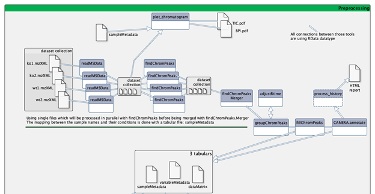


**Figure2: LCMS preprocessing workflow.**

The metabolome analysis workflow is available at the following servers and docker image

https://usegalaxy.eu/

https://africa.usegalaxy.eu/

https://india.usegalaxy.eu/

https://streetscience.usegalaxy.eu/

https://usegalaxy.org.au/

https://workflow4metabolomics.usegalaxy.fr/

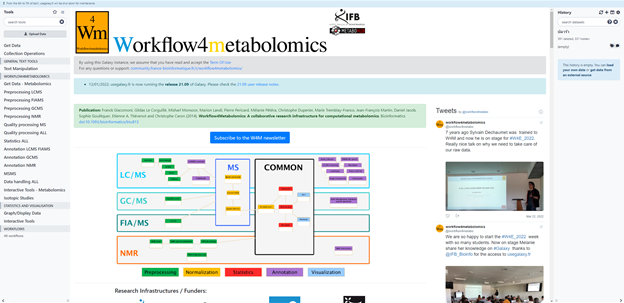

For those of you who do not want to upload your data to server, galaxy can be run locally in your PC using docker

## LC-MS data pre-processing 
### Step 1. Upload data

In metabolomics studies, the number of samples can vary a lot (from a handful to several hundreds). Thus, extracting your data from the raw files can be very fast, or take quite a long time. To optimise the computation time as much as possible, the W4M core team chose to develop tools that can run single raw files for the first steps of pre-processing in parallel, since the initial actions in the extraction process treat files independently.

Since the first steps can be run on each file independently, the use of Dataset collections in Galaxy is recommended, to avoid having to launch jobs manually for each sample. You can start using the dataset collection option from the very beginning of your analysis, when uploading your data into Galaxy.

click on the upload icon on the top left of the screen next to the word "Tools"
- Select collection tab
- Select choose local file
- Select workshop dataset 
- Set file type to mzXML
- Press start
- After upload completed click build, name the list as mzXML

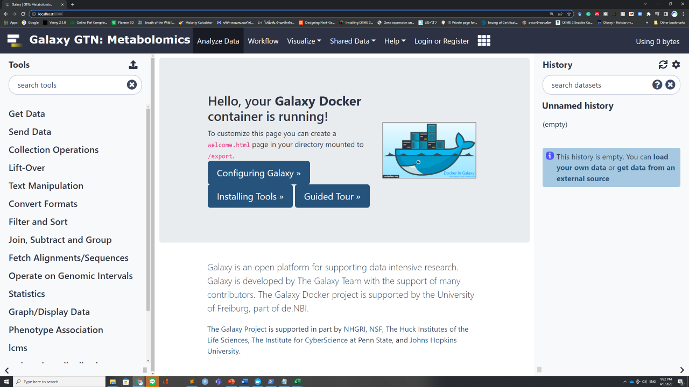

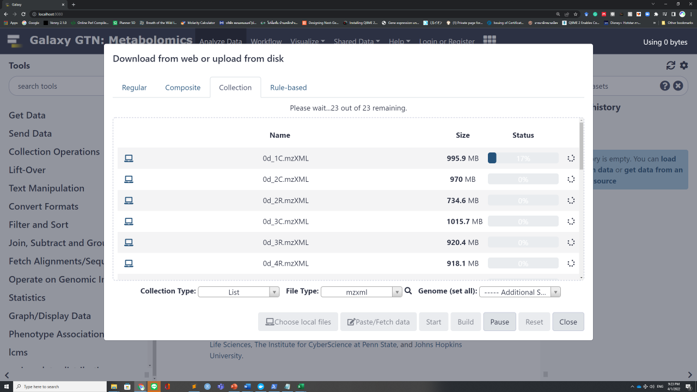

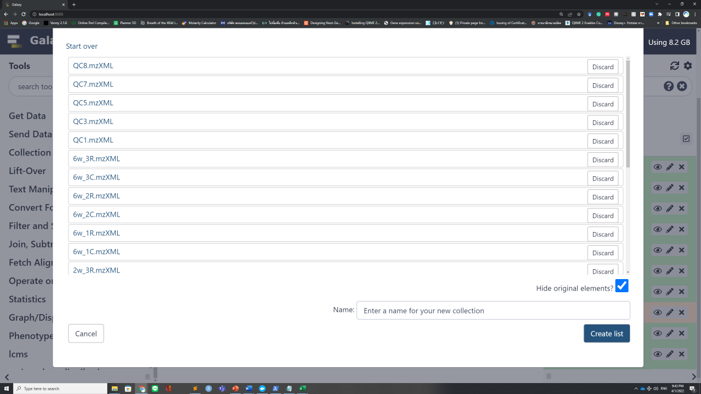


### Step 2. Read data using XCMS: MSnbase readMSData

This first step is only meant to read your mzXML file and generate an object usable by XCMS 

MSnbase readMSData tool, prior to XCMS tool is able to read files with open format as mzXML, mzMl, mzData and netCDF, which are independent of the constructors’ formats. The XCMS tool package itself is composed of R functions able to extract, filter, align and fill gap, with the possibility to annotate isotopes, adducts and fragments using the R package CAMERA (Carsten Kuhl 2017). This set of functions gives modularity, and thus is particularly well adapted to define workflows, one of the key points of Galaxy.


- Type in the tool search box readMSData
- Select XCMS: MSnbase readMSData
- Select mzXML collection
- Execute

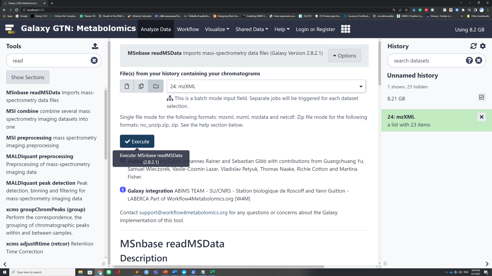

### Step 3. Create and upload meta data as tab delimited file

The sampleMetadata file is a tab-separated table, in text format. This table has to be filled by the user. You can use any software you find appropriate to construct your table, as long as you save your file in a compatible format. For example, you can use a spreadsheet software such as Microsoft Excel or LibreOffice.

- Create metadata in MS excel
- Save as tab-delimited (.txt) file
- Upload to galaxy (file type tabular)


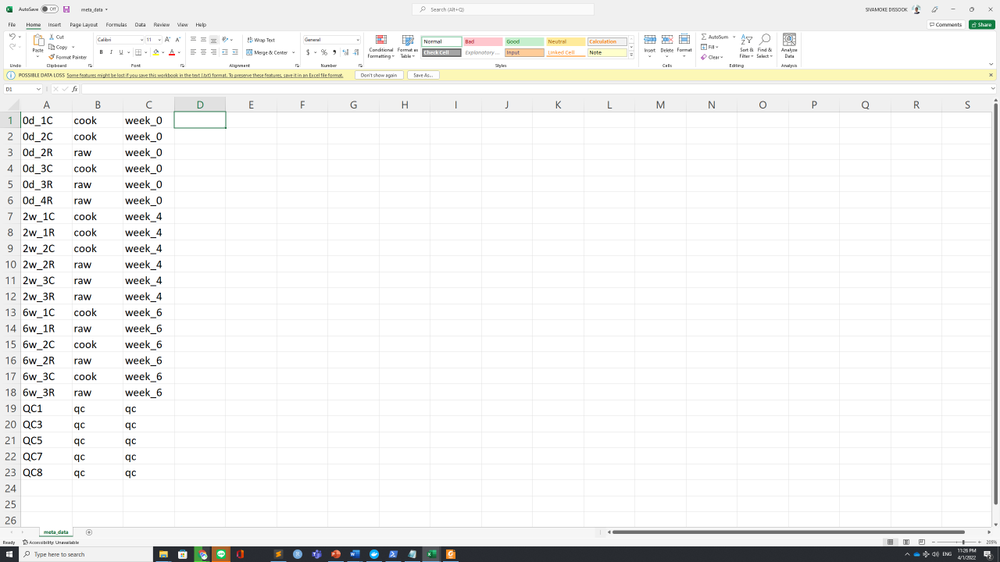

The file has to be a .txtor a .tsv (tab-separated values). Neither .xlsx nor .odt are supported. If you use a spreadsheet software, be sure to change the default format to Text (Tab delimited) or equivalent.

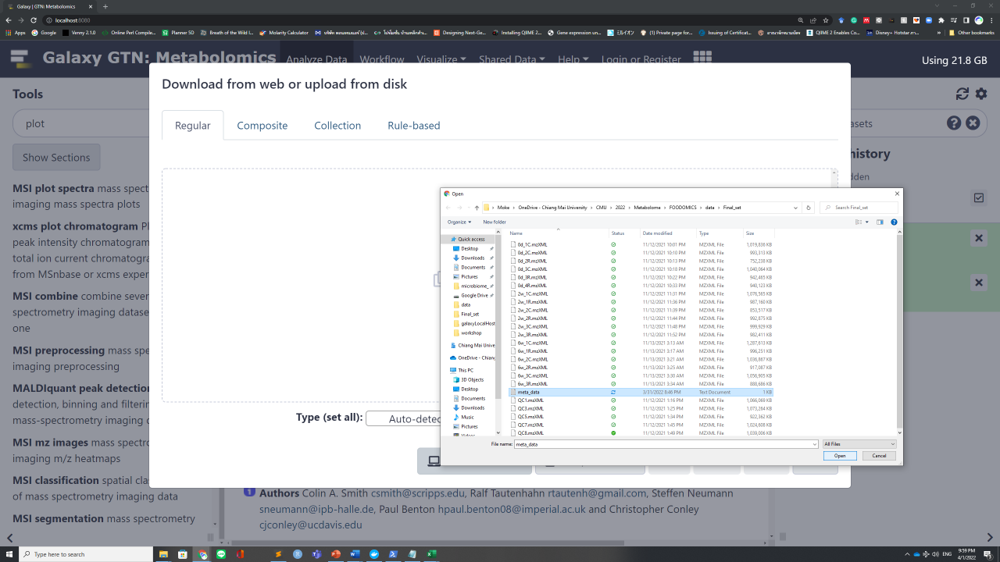

Once your sampleMetadata table is ready, you can proceed to the upload. In this tutorial we already prepared the table for you ;)

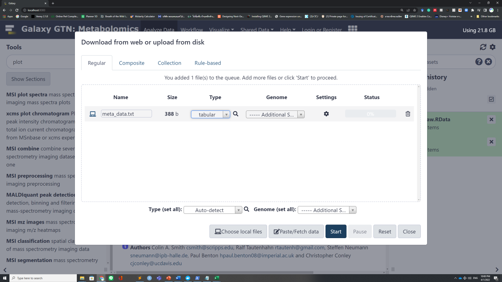

### Step 4. Getting an overview of your samples’ chromatograms

You may be interested in getting an overview of what your samples’ chromatograms look like, for example to see if some of your samples have distinct overall characteristics, e.g. unexpected chromatographic peaks or huge overall intensity.

You can use the sampleMedata file we previously uploaded to add some group colours to your samples when visualising your chromatograms. The tool automatically takes the second column as colour groups when a file is provided.

Note that you can also check the chromatograms at any moment during the workflow

- Type in the tool search box “xcms plot chromatogram”
- Select mzXML.raw.RData as input > execute
- When the process complete click the eye button to visualize the data

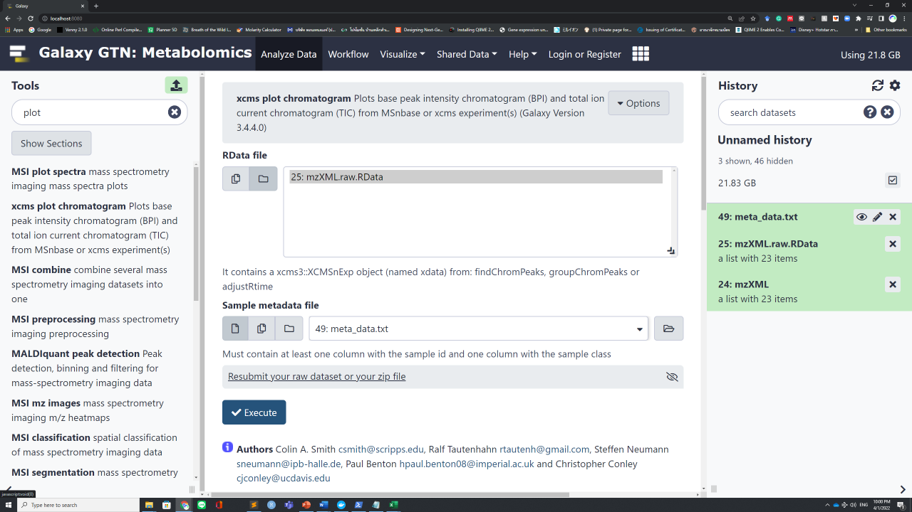

This tool generates Base Peak Intensity Chromatograms (BPIs) and Total Ion Chromatograms (TICs). If you provide groups as we do here, you obtain two plots: one with colours based on provided groups, one with one colour per sample.

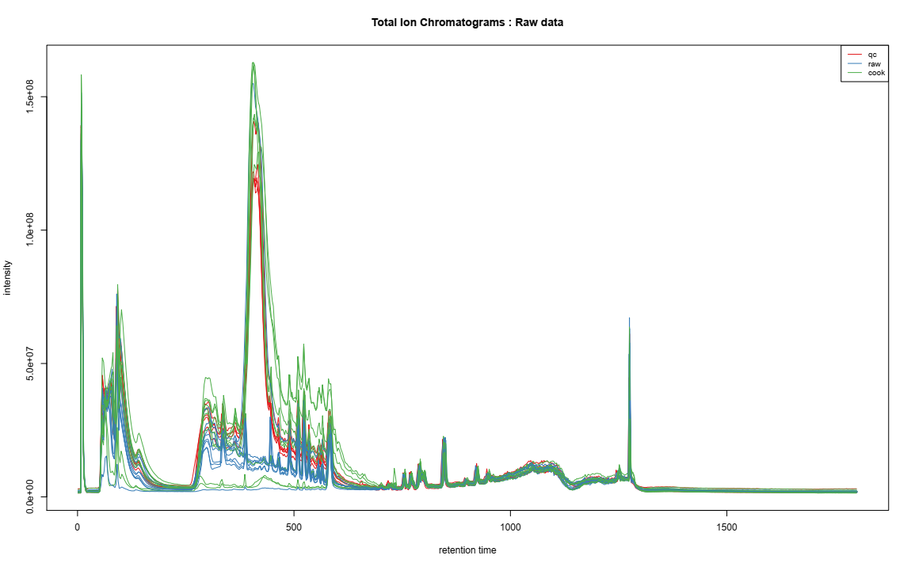


### Step 5. Peak picking
Now that your data is ready for XCMS processing, the first step is to extract peaks from each of your data files independently. The idea here is, for each peak, to proceed to chromatographic peak detection.
The XCMS solution provides two different algorithms to perform chromatographic peak detection: matchedFilter and centWave. The matchedFilter strategy is the first one provided by the XCMS R package. It is compatible with any LC-MS device, but was developed at a time when high resolution mass spectrometry was not common standard yet. On the other side, the centWave algorithm (Tautenhahn et al. 2008) was specifically developed for high resolution mass spectrometry, dedicated to data in centroid mode. In this tutorial, you will practice using the centWave algorithm.

- Type in the tool search box “peak picking”
- Select xcms findChromPeaks
- Select mzXML.raw.RData as input > execute

Along with the parameters used in the core centWave algorithm, XCMS provides other filtering options allowing you to get rid of ions that you don’t want to consider. For example, you can use Spectra Filters allowing you to discard some RT or M/z ranges, or Noise filter (as in this hands-on) not to use low intensity measures in the ROI detection step.

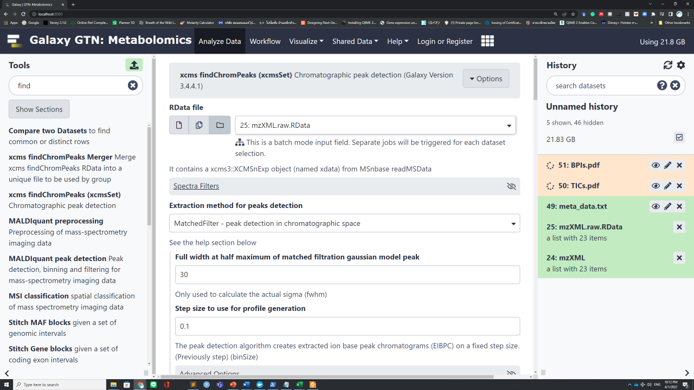

At this step, you obtain a dataset collection containing one RData file per sample, with independent lists of ions. Although this is already a nice result, what you may want now is to get all this files together to identify which ions are shared between samples. To do so, XCMS provides a function that is called groupChromPeaks (or group). But before proceeding to this grouping step, first you need to group your individual RData files into a single one.


### Step 6. Merging peak data into one data 

Gathering the different samples in one Rdata file
A dedicated tool exists to merge the different RData files into a single one: xcms findChromPeaks Merger tool. Although you can simply take as input your dataset collection alone, the tool also provides de possibility to take into account a sampleMetadata file. Indeed, depending of your analytical sequence, you may want to treat part of your samples a different way when proceeding to the grouping step using xcms groupChromPeaks (group)

- Type in the tool search box “merge”
- Select xcms findChromPeaks Merger
- Select mzXML.raw.xset.RData as input > execute

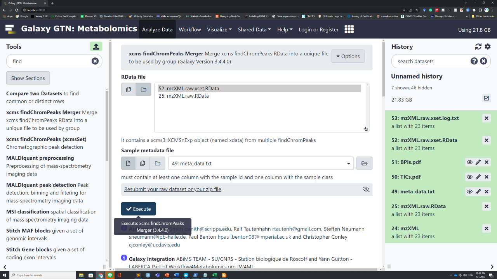

### Step 7. determining shared ions across samples

The first peak picking step gave us lists of ions for each sample. However, what we want now is a single matrix of ions intensities for all samples. To obtain such a table, we need to determine, among the individual ion lists, which ions are the same. This is the aim of the present step, called ‘grouping’.

The group function aligns ions extracted with close retention time and close m/z values in the different samples. In order to define this similarity, we have to define on one hand a m/z window and on the other hand a retention time window. A binning is then performed in the mass domain. The size of the bins is called width of overlapping m/z slices. You have to set it according to your mass spectrometer resolution.

Then, a kernel density estimator algorithm is used to detect region of retention time with high density of ions. This algorithm uses a Gaussian model to group together peaks with similar retention time.

The inclusion of ions in a group is defined by the standard deviation of the Gaussian model, called bandwidth. This parameter has a large weight on the resulting matrix. It must be chosen according to the quality of the chromatography. To be valid, the number of ions in a group must be greater than a given number of samples. Either a percentage of the total number of samples or an absolute value of samples can be given. This is defined by the user.


- Type in the tool search box “group”
- Select xcms groupChromPeak
- Select xset.merged.RData as input > execute

This grouping step is very important because it defines the data matrix which will be used especially for the statistical analyses. User has to check the effect of parameter values on the result.


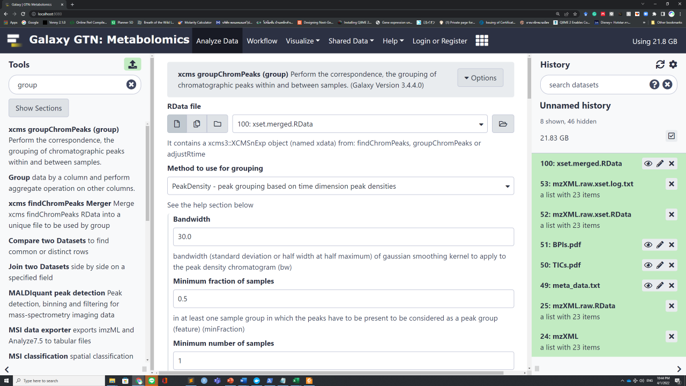

In order to check the result of the grouping function, a pdf file is created. It provides one plot per m/z slice found in the data. Each picture represents the peak density across samples, plotting the corresponding Gaussian model which width is defined by the bandwidth parameter. Each red dot corresponds to a sample. The plot allows to assess the quality of alignment. The grey areas’ width is associated with the bandwidth parameter

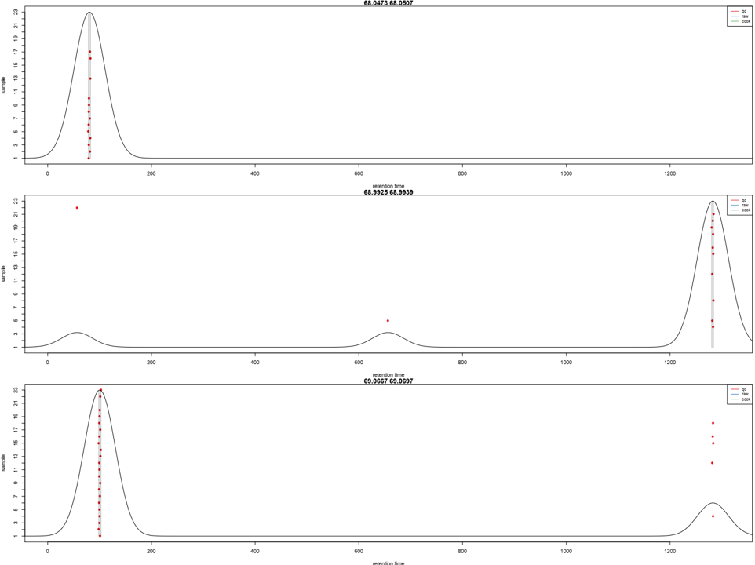


### Step 8. retention time correction

Sometimes with LC-MS techniques, a deviation in retention time occurs from a sample to another. In particular, this is likely to be observed when you inject large sequences of samples.

This optional step aims to correct retention time drift for each peak among samples. The correction is based on what is called well behaved peaks, that are peaks found in all samples or at least in most of the samples.

Sometimes it is difficult to find enough peaks present in all samples. The user can define a percentage of the total number of samples in which a peak should be found to be considered a well behaved peak. This parameter is called minimum required fraction of samples.

On the contrary, you may have peak groups with more detected peaks than the total number of samples. Those peaks are called additional peaks. If you do not want to consider peak groups with too much additional peaks as ‘well behaved peaks’, you can use the ‘maximal number of additional peaks’ parameter to put them aside.

The algorithm uses statistical smoothing methods. You can choose between linear or loess regression.


- Type in the tool search box “retcor”
- Select xcms adjustRtime
- Select xset.merged.group.Chrom.RData as input > execute
- Repeat step 7 with xset.merged.group.Chrom.adjustRtime.RData as input > execute

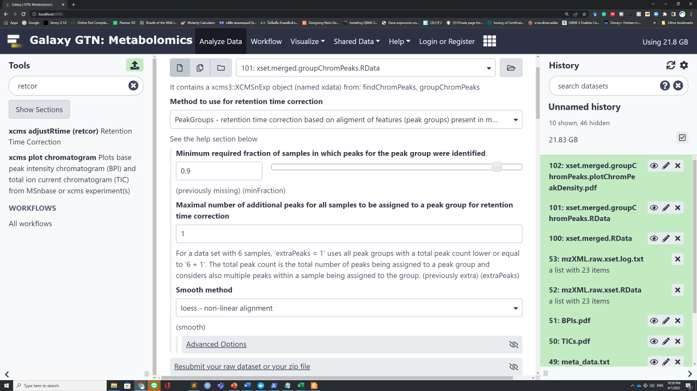

This tool generates a plot output that you can use to visualise how retention time was applied across the samples and along the chromatogram. It also allows you to check whether the well behaved peaks were distributed homogeneously along the chromatogram.

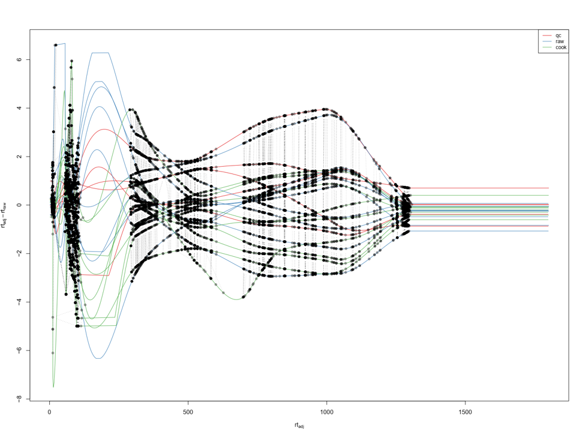

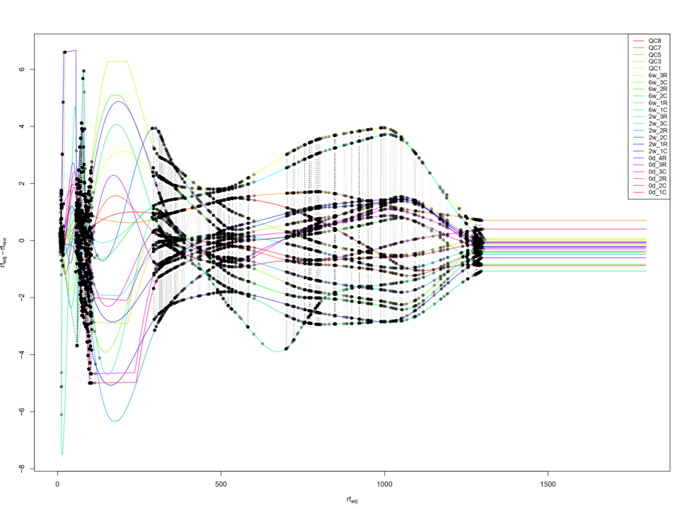

The retention time correction step is not mandatory. However, when it is used retention time are modified. Consequently, applying this step on your data requires to complete it with an additional ‘grouping’ step using the xcms groupChromPeaks (group) tool tool again.

Parameters for this second group step are expected to be similar to the first group step. Nonetheless, since retention times are supposed to be less variable inside a same peak group now, in some cases it can be relevant to lower a little the bandwidth parameter.

It is possible to use the retention time correction and grouping step in an iterative way if needed. Once you perform your last adjustRtime step and thus your last grouping step, you will obtain your final peak list (i.e. final list of ions).

### Step 9. integrating areas of missing peaks

At this point of the XCMS extraction workflow, the peak list may contain NA when peaks where not considered peaks in only some of the samples in the first ‘findChromPeaks’ step. This does not necessary means that no peak exists for these samples. For example, sometimes peaks are of very low intensity for some samples and were not kept as peaks because of that in the first ‘findChromPeaks’ step.

To be able to get the information that may actually exist behind NAs, there is an additional XCMS step that is called fillChromPeaks.

A sampleMetadata file (if not done yet, to be completed with information about your samples)
A dataMatrix file (with the intensities)
A variableMetadata file (with information about ions such as retention times, m/z)


- Type in the tool search box “fillPeaks”
- Select xcms fillChromPeaks (fillPeaks)
- Select xset.merged.group.Chrom.adjustRtime.groupChromPeaks.RData as input > execute
 as input > execute after the process was done the data matrix can be download ny clicking at the data and click at the disket sign
 
 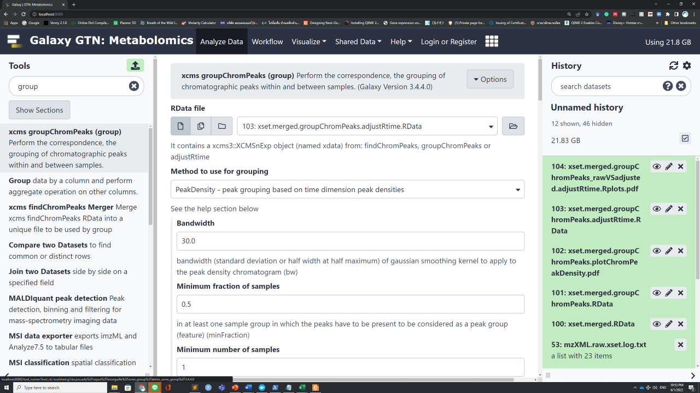
 
 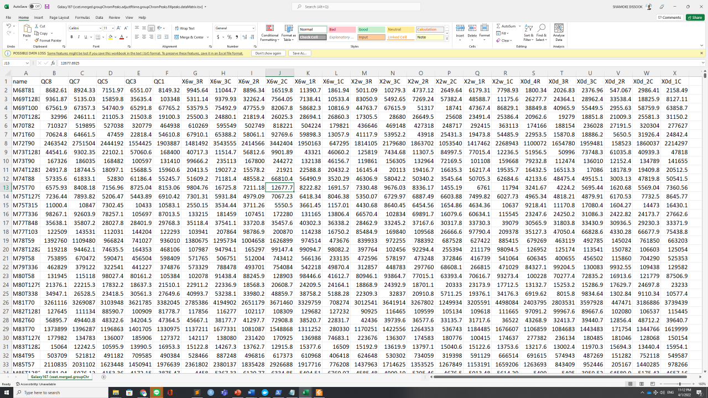


 With this ‘fillChromPeaks’ step, you obtain your final intensity table. At this step, you have everything mandatory to begin analysing your data:

 


---
[↥ **Back to top**](#top)
