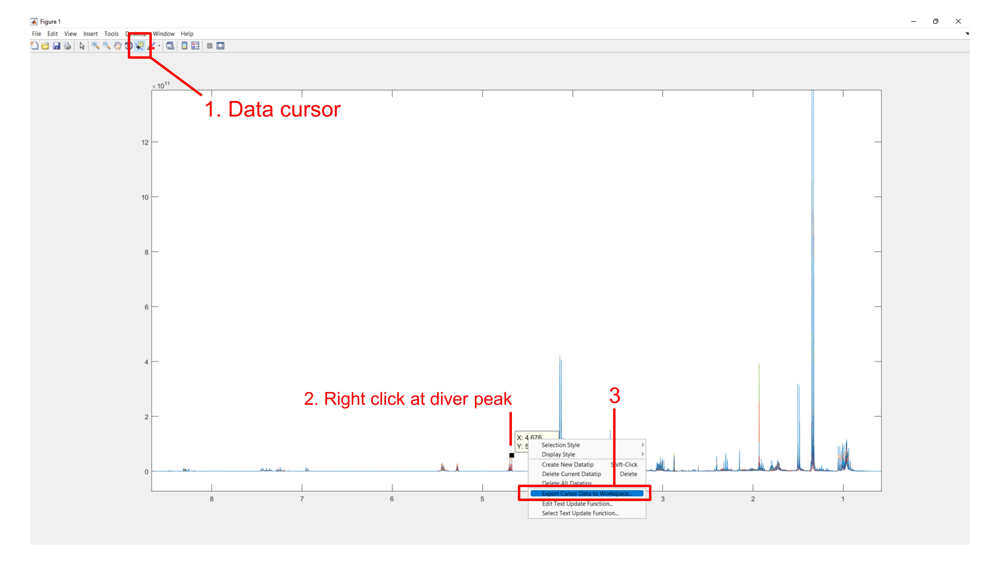
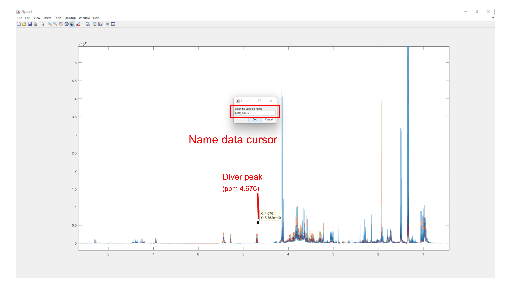
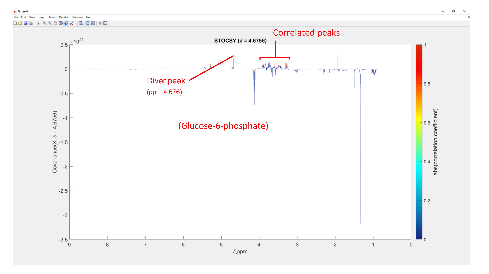

# Metabolite identification

## Table of Contents
1. [NMR metabolite identification](#nmr)
2. [LC-MS metabolite identification](#lcms)

## NMR metabolite identification <a name="nmr"></a>
First, we are going to use Statistical Total Correlation Spectroscopy (STOCSY) toolbox on MATLAB to identify the correlated resonances of metabolites of interest.

Open MATLAB on KKUIPL laptop

In MATLAB, make sure that you have set the working directory to where your processed data are stored (look at the left-hand panel if you could see your data file in .mat format). In this case, if you use KKUIPL laptop, the processed NMR data are stored at \D:\CliNaP_April2022\Processed_NMR_Data (Fig. 1)


**Figure 1**

```bash 
#Plot processed NMR spectra

Figure;
Plot(ppm, xaln);
Set(gca, 'Xdir', 'Reverse');
```
You will obtain the processed NMR spectra below.


**Figure 2**

Now, click data cursor and click the NMR signal of interest - in this case, we are going to select 1.329 ppm (doublet) as the driver peak. Then, right click this peak and choose 'export cursor data to work space'.  


**Figure 3**

Name the cursor data as peak_1p329 and click 'ok'.


**Figure 4**

In MATLAB command window, do the following:

```bash
#Perform STOCSY using the peak at 1.329 ppm as the driver peak
STOCSY(xaln, ppm, peak_1p329.Position(1),0.000001);
```

Now, you should obtain the STOCSY spectra below. The correlated resnonace of the driver peak (1.329 ppm) is a protron resonance at 4.146 ppm (quartet) indicated by the similar correlation coefficient.


**Figure 5**


**Figure 6**


**Figure 7**


**Figure 8**


**Figure 9**


**Figure 10**


**Figure 11**


**Figure 12**


**Figure 13**


**Figure 14**


**Figure 15**


**Figure 16**


**Figure 17**


---
[↥ **Back to top**](#top)

## LC-MS metabolite identification <a name="lcms"></a>
For LC-MS/MS based approach, MS-DIAL software is employed for metabolite identification using quality control samples.

Step 1 File Conversion
-	Start “AnalysisBaseFileConverter.exe”.
-	Drag & drop MS files (.d) into this program.
-	Click “Convert”.
-	The ABF files are generated in the same directory as the raw data files. (Figure 1)

**Figure 1**

Step 2 Project Creation
2.1 Click “File” then click “New project”

**Figure 2**
---
[↥ **Back to top**](#top)
