# Metabolite identification

## Table of Contents
1. [NMR metabolite identification](#nmr)
2. [LC-MS metabolite identification](#lcms)

## NMR metabolite identification <a name="nmr"></a>

### Performing STOCSY in MATLAB environment
Now, we are going to use Statistical Total Correlation Spectroscopy (STOCSY) toolbox on MATLAB to identify the correlated resonances of metabolites of interest. Let's get started with these three signals.

Open MATLAB on KKUIPL laptop

In MATLAB, make sure that you have set the working directory to where your processed data are stored (look at the left-hand panel if you could see your data file in .mat format). In this case, if you use KKUIPL laptop, the processed NMR data are stored at \D:\CliNaP_April2022\Processed_NMR_Data (Fig. 1)

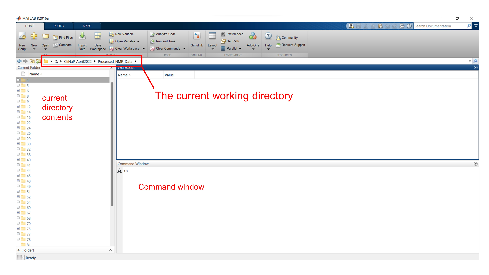

```bash 
#Plot processed NMR spectra

Figure
Plot(ppm, xaln)
Set(gca, 'Xdir', 'Reverse')
```
You will obtain the processed NMR spectra below.

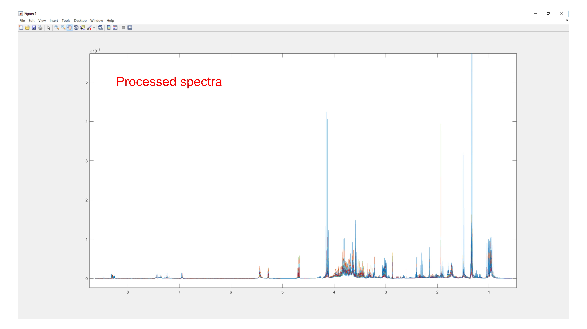

Now, click data cursor and click the NMR signal of interest - in this case, we are going to select 1.329 ppm (doublet) as the driver peak. Then, right click this peak and choose 'export cursor data to work space'.  

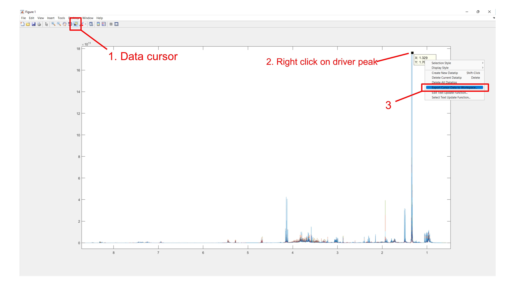

Name the cursor data as peak_1p329 and click 'ok'.

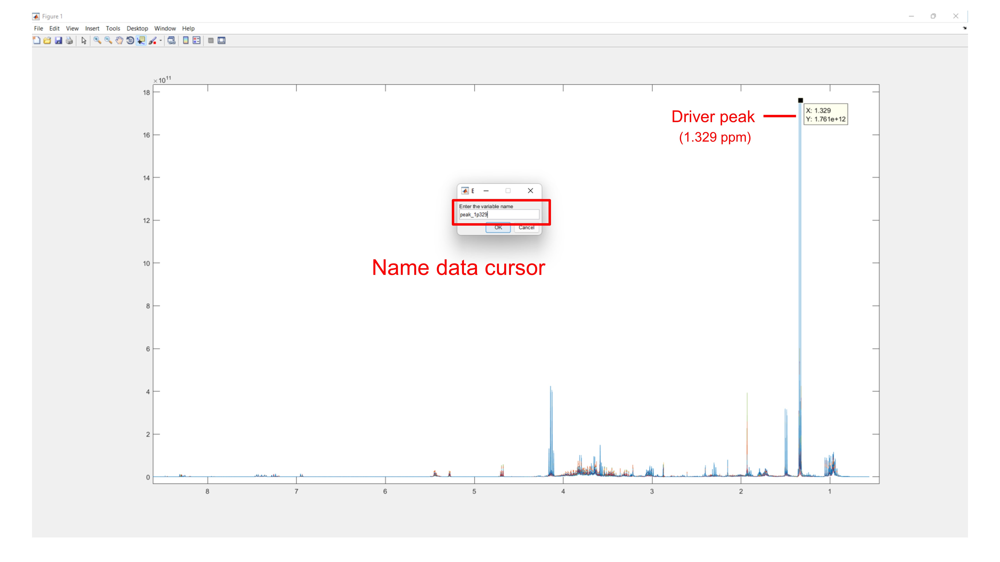

In MATLAB command window, do the following:

```bash
#Perform STOCSY using the peak at 1.329 ppm as the driver peak

STOCSY(xaln, ppm, peak_1p329.Position(1),0.000001)
```

Now, you will obtain the STOCSY spectra below. The correlated resnonace of the driver peak (1.329 ppm) is a protron resonance at 4.146 ppm (quartet) indicated by the similar correlation coefficient (or similar colour intensity). You need to record the driver peak and its correlated peaks from STOCSY spectra on your safe place i.e. Excel spreadsheet. 

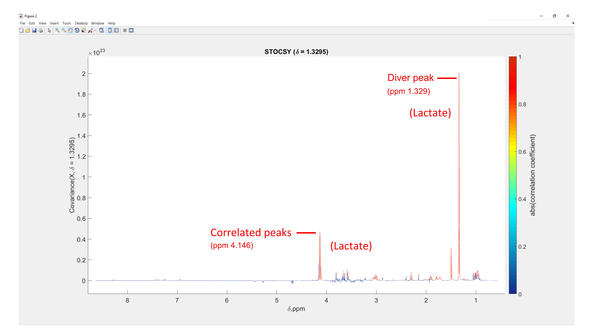

Now, open the processed NMR spectra on MATLAB again and click 'data cursor', then click the peak at 1.933 ppm (singlet). Right-click and select 'export cursor data to workspace'.

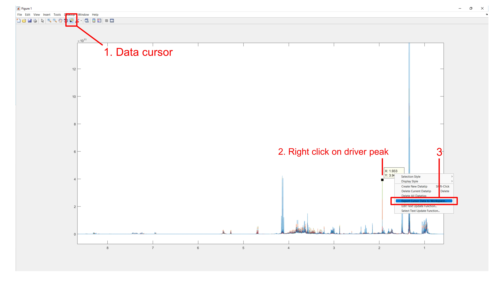

Name the cursor data as peak_1p933 and click 'ok'.

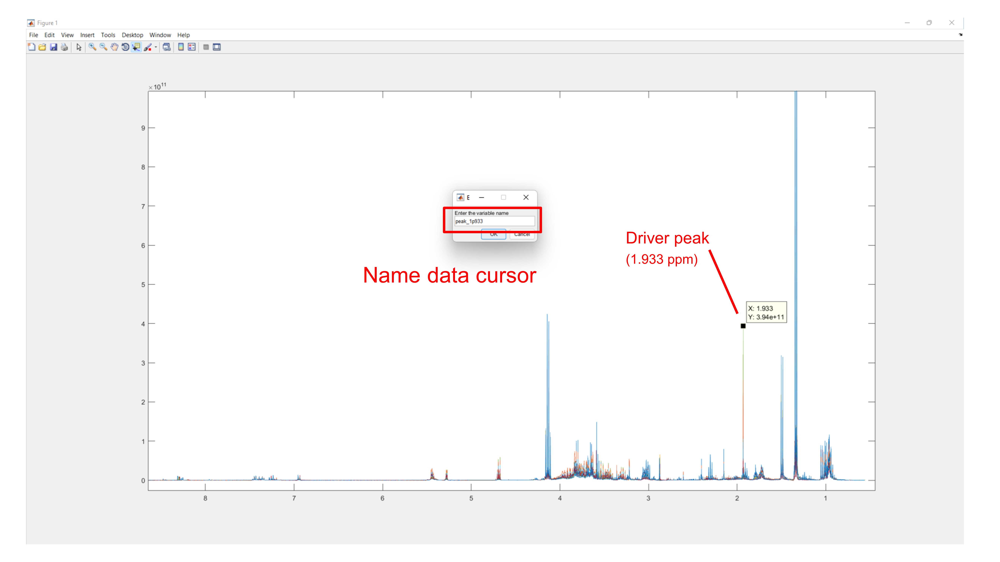

In MATLAB command window, do the following:

```bash
#Perform STOCSY using the peak at 1.933 ppm as the driver peak

STOCSY(xaln, ppm, peak_1p933.Position(1),0.000001)
```

Now, you will obtain the STOCSY spectra below. No correlated resnonace of the driver peak (1.933 ppm) is detected. You need to record the result from STOCSY spectra on your safe place i.e. Excel spreadsheet, in this case, 'no STOCSY correlation'. 

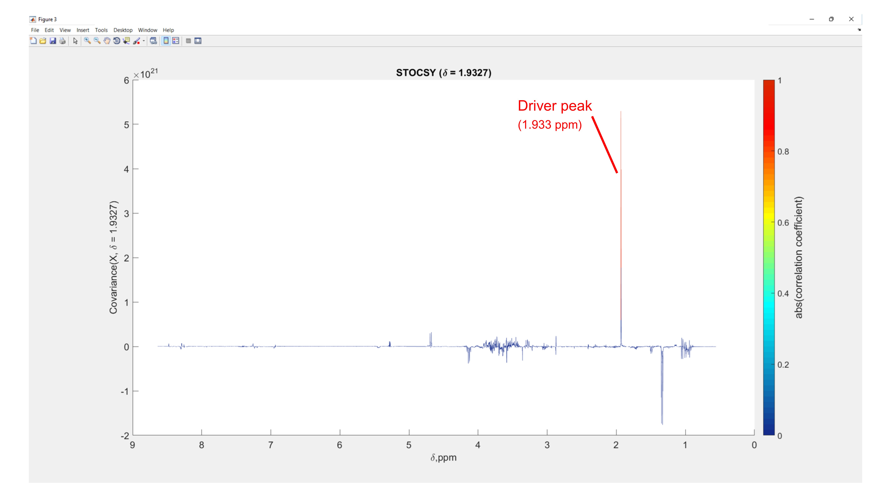

Now, open the processed NMR spectra on MATLAB again and click 'data cursor', then click the peak at 3.007 ppm (doublet of doublets). Right-click and select 'export cursor data to workspace'.

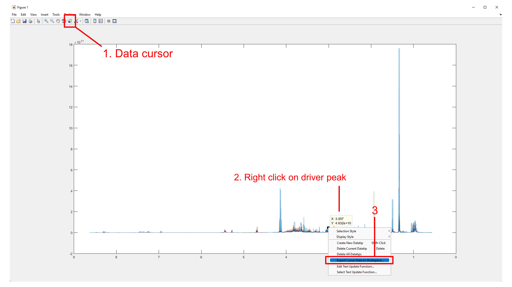

Name the cursor data as peak_3p007 and click 'ok'.


In MATLAB command window, do the following:

```bash
#Perform STOCSY using the peak at 3.007 ppm as the driver peak

STOCSY(xaln, ppm, peak_3p007.Position(1),0.000001)
```

Now, you will obtain the STOCSY spectra below. The correlated resnonaces of the driver peak (3.007 ppm) include the protron resonances at 3.17 ppm (doublet of doublets), 3.98 ppm (doublet of doublets), 6.94 ppm (doublet of doublets of doublets) and 7.19 ppm (doublet) indicated by the similar correlation coefficient (or similar colour intensity). You need to record the driver peak and its correlated peaks from STOCSY spectra on your safe place i.e. Excel spreadsheet. 

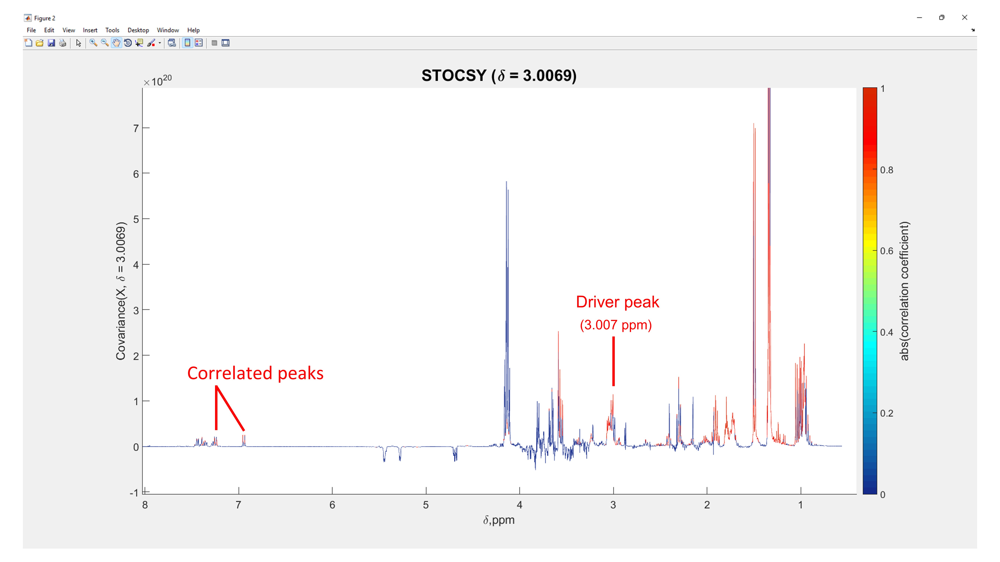

Now, open the processed NMR spectra on MATLAB again and click 'data cursor', then click the peak at 4.676 ppm (doublet of doublets). Right-click and select 'export cursor data to workspace'.

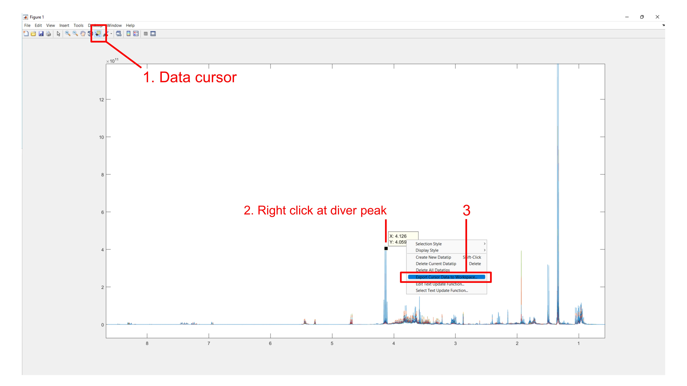

Name the cursor data as peak_4p676 and click 'ok'.


In MATLAB command window, do the following:

```bash
#Perform STOCSY using the peak at 4.676 ppm as the driver peak

STOCSY(xaln, ppm, peak_4p676.Position(1),0.000001)
```

Now, you will obtain the STOCSY spectra below. The correlated resnonaces of the driver peak (4.676 ppm) include a few protron resonances at 3 - 4 ppm and a peak at 5.2 (doublet) indicated by the similar correlation coefficient (or similar colour intensity). You need to record the driver peak and its correlated peaks from STOCSY spectra on your safe place i.e. Excel spreadsheet.

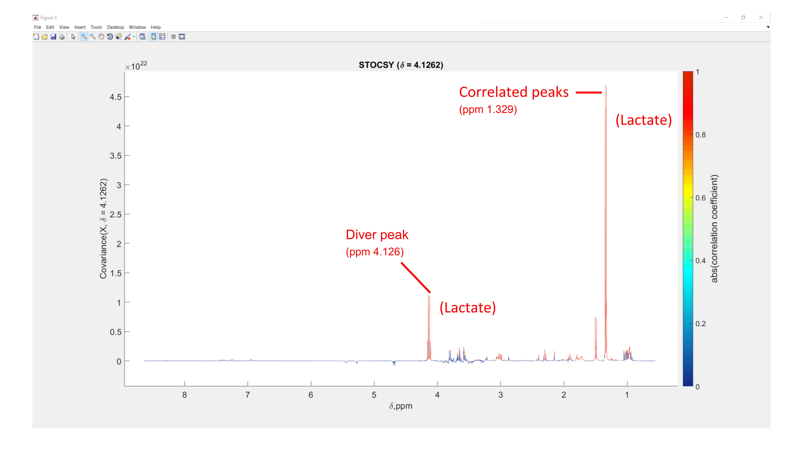

### Searching against Chenomx database

---
[↥ **Back to top**](#top)

## LC-MS metabolite identification <a name="lcms"></a>
### MS-DIAL
For LC-MS/MS based approach, MS-DIAL software is employed for metabolite identification using quality control samples.

#### Step 1 File Conversion
-	Start “AnalysisBaseFileConverter.exe”.
-	Drag & drop MS files (.d) into this program.
-	Click “Convert”.
-	The ABF files are generated in the same directory as the raw data files. (Figure 1)
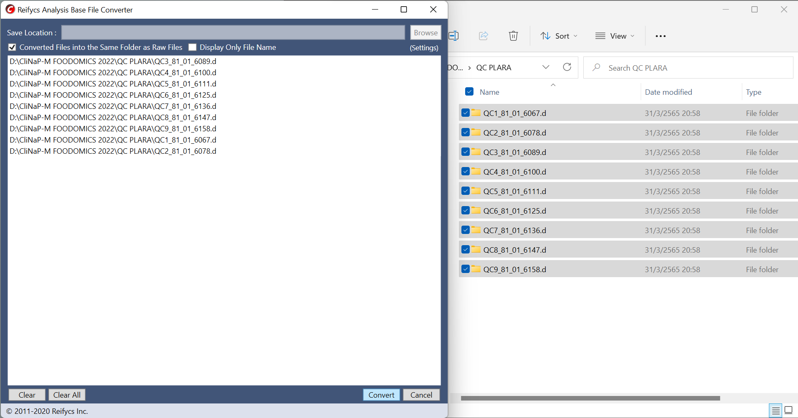
**Figure 1**

#### Step 2 Project Creation
2.1 Click “File” then click “New project” (Figure 2,3)
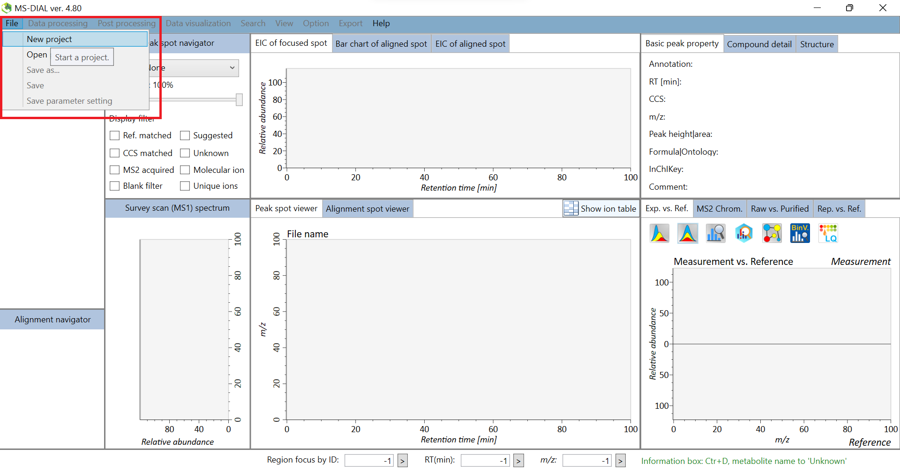
**Figure 2**


**Figure 3**

2.2 Browse a folder containing ABF files (Figure 4)
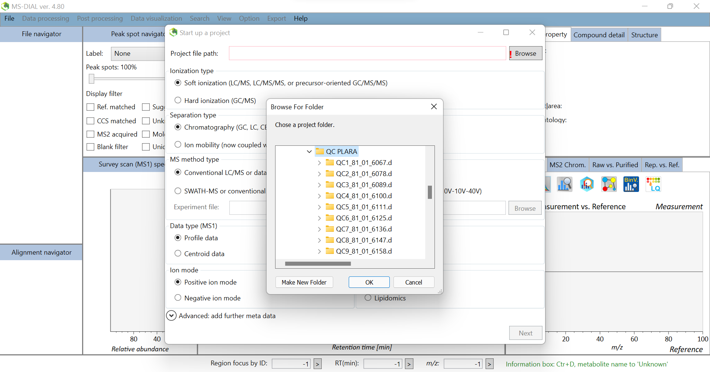
**Figure 4**

2.3 Select the details for LC-MS/MS (Figure 5)

1) Select Ionization type
2) Select Separation type
3) Select MS mode type
4) Select Data type (MS1 and MS/MS)
5) Select Ion mode
6) Select Target omics
7) Click “Next”
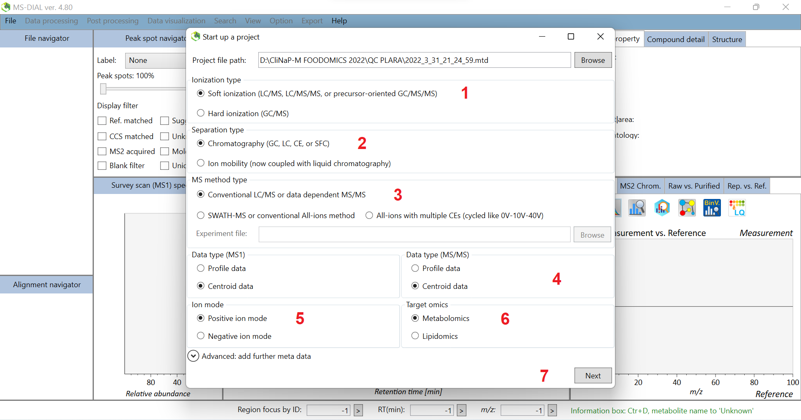
**Figure 5**

2.4 Importing ABF files (Figure 6,7)

1) Select ABF files 
2) Set the file as “Quality Control (QC)”
3) Edit injection volume (in this sample, we injected 2 uL)

**Figure 6**

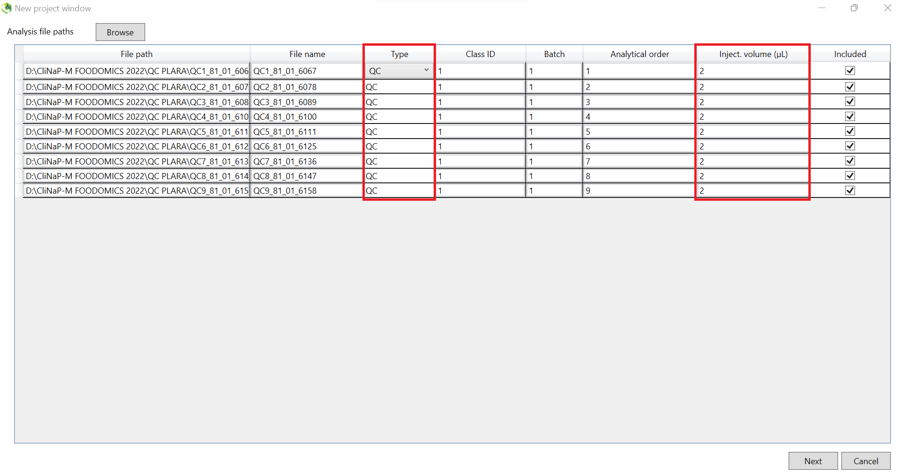
**Figure 7**

2.5 Setting parameters

1) Data collection tab
	Mass accuracy: After the peak detection algorithm is applied along the MS axis with a very low threshold, MS-DIAL performs spectral centroiding. By default, mass spectrum of ±0.01 and ±0.05 Da range from each peak top is integrated in MS1 and MS2, respectively. Importantly, this MS2 tolerance value is also used to build the MS/MS chromatogram for a certain m/z trace. The MS/MS chromatograms are dedicated to the MS2Dec deconvolution program.
	Data collection parameters: You can set analysis ranges (RT, MS1 and MS/MS axis). In this demonstration, your expected data range is 0-30 min for 50-1000 Da.
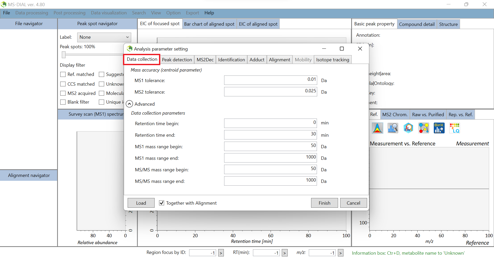
**Figure 8**

2) Peak detection tab
	MS-DIAL provides two simple thresholds: minimum values for peak width and height. Peaks below these thresholds are ignored.
	Minimum peak width: indicates a threshold of peak width for filtering (0.1 and 0.05 are suitable for Q-TOF and Orbitrap, respectively).
	Smoothing method: Linear-weighted moving average is used for the peak detection as default to accurately determine the peak left- and right edges. The recommended smoothing level is 1-3. (If you already know unwanted m/z peaks because of columns or solvent contaminants, you can specify them in the Exclusion mass list).

**Figure 9**

3) MS2Dec tab
	Deconvolution parameters mean the cut-off values to reduce the MS noises. The sigma window value is highly affected by the resolution of deconvolutions. A higher value (0.7-1.0) will reduce the peak top resolutions, i.e. the number of resolved peaks will be decreased. On the other hand, a lower value (0.1-0.3) may also recognize many noise chromatographic peaks.
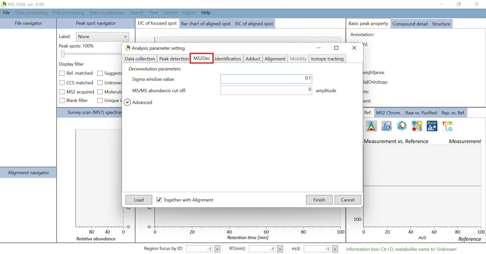
**Figure 10**

4) Identification tab
	MSP file is a mass spectrum file format for MS/MS spectrum that available on MS-DIAL website (http://prime.psc.riken.jp/compms/msdial/main.html#MSP).

**Figure 11**

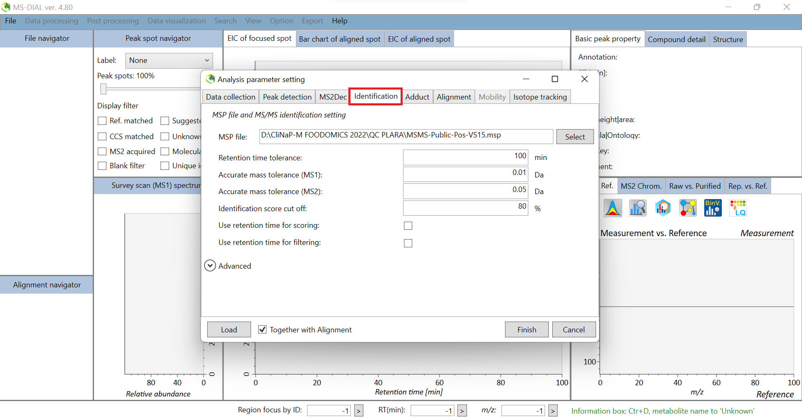
**Figure 12**

5) Adduct tab
	You can tick the adduct ions and charge values to be considered.
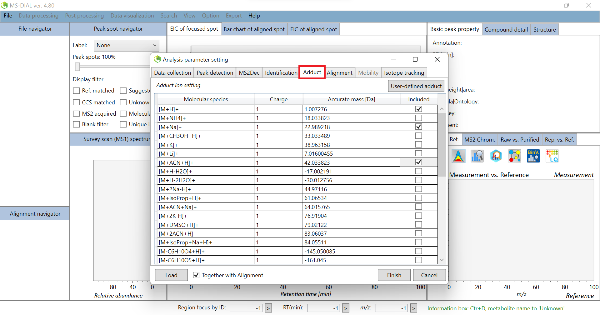
**Figure 13** 

6) Alignment tab
	Result name will be the name of each alignment shown at the pane ‘Alignment navigator’ in the main window.
	The RT and MS1 tolerances for peak alignment depend on your chromatographic conditions.
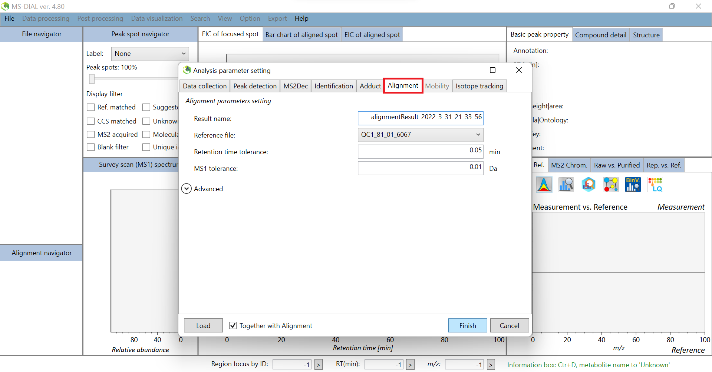
**Figure 14** 

#### Step 3: Compound Identification
The output of data filtering 

1) MS1 spectrum
2) EIC: Extract ion chromatogram
3) Peak property
4) Experimental MS/MS spectrum
5) Reference MS/MS spectrum

The metabolite searching can be carried out using either retention time (RT) or mass-to-charge (m/z) at the bottom panel.
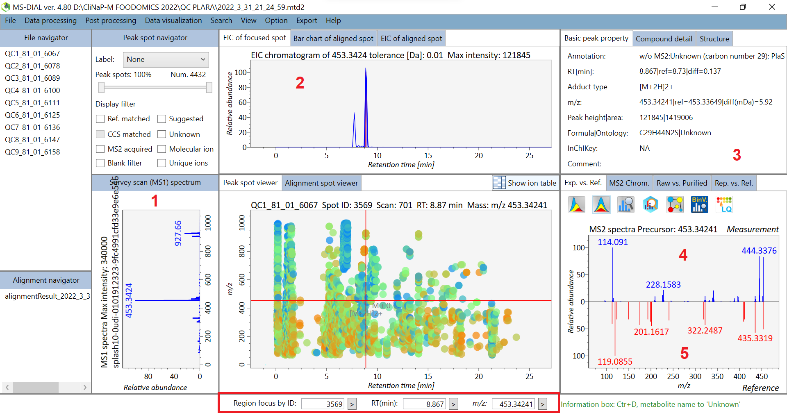
**Figure 15** 

### Human metabolome database (HMDB)
The Human Metabolome Database (HMDB) is a freely available electronic database containing detailed information about small molecule metabolites found in the human body. It is intended to be used for applications in metabolomics, clinical chemistry, biomarker discovery and general education. The database is designed to contain or link three kinds of data: 1) chemical data, 2) clinical data, and 3) molecular biology/biochemistry data. The database contains 114,193 metabolite entries including both water-soluble and lipid soluble metabolites as well as metabolites that would be regarded as either abundant (> 1 uM) or relatively rare (< 1 nM). Additionally, 5,702 protein sequences are linked to these metabolite entries. (Source:  https://hmdb.ca/)

1) Go to  https://hmdb.ca/ > Click Search > Click LC-MS Search


2) Add “m/z” > Set parameter > Click Search
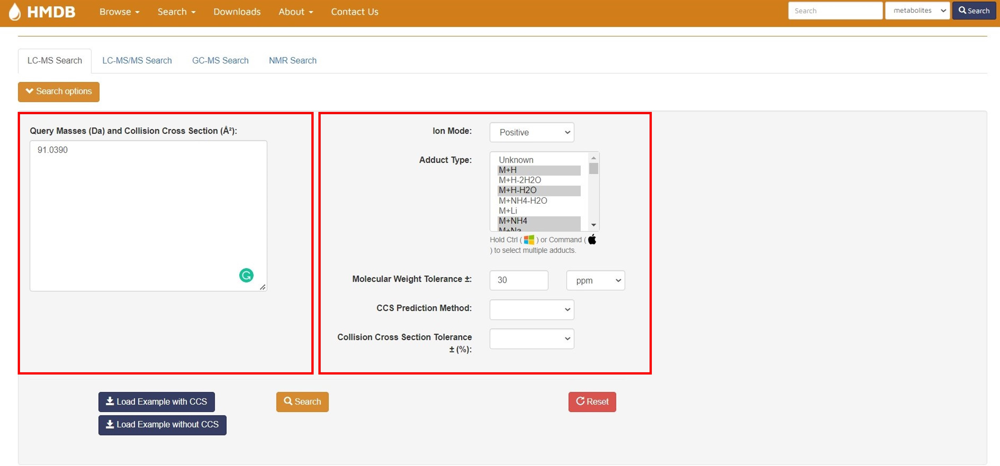

3) List of matched metabolites
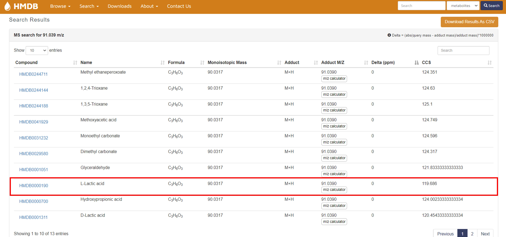

4) Description of metabolite
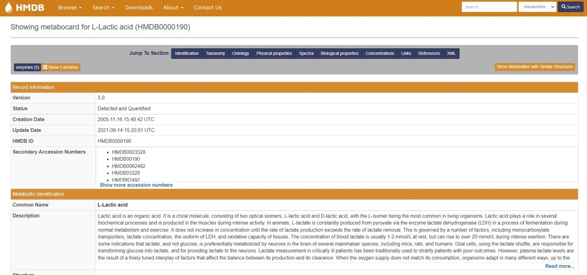
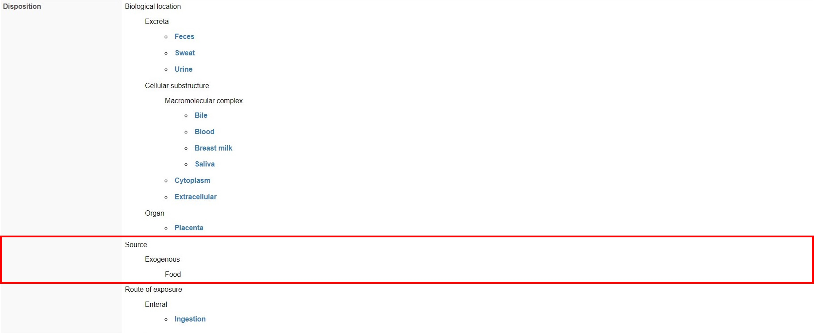

5) Select MS/MS Spectra with “Experimental Conditions” to confirm fragmentation patterns of spectrum
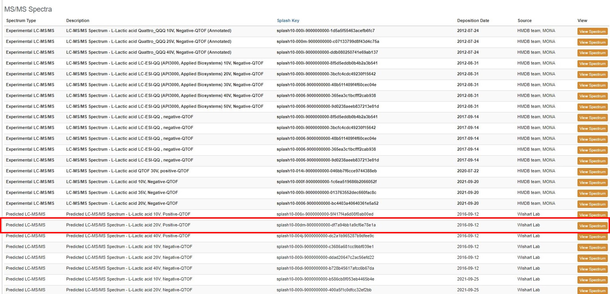

6) Spectrum details, spectrum view, and experimental conditions
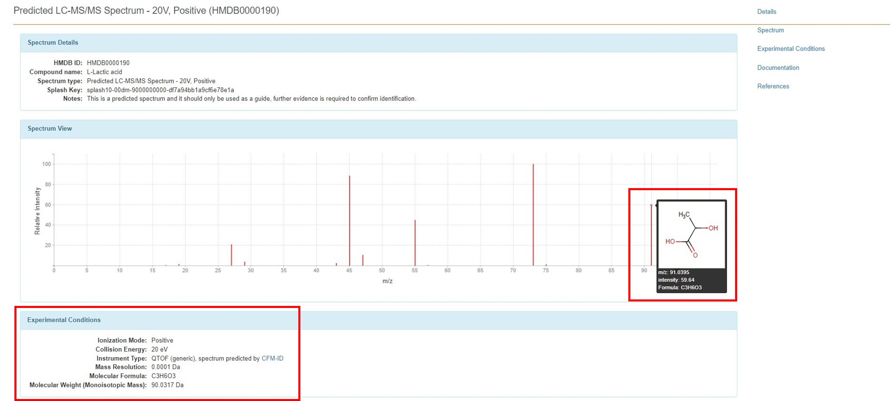

### METLIN
METLIN has multiple searching capabilities including single, batch, precursor ion, neutral loss, accurate mass, and fragment searches. The popular similarity search algorithm for unknown characterization, another METLIN search option, originated on METLIN in 2008. METLIN now includes over a million molecules ranging from lipids, steroids, plant & bacteria metabolites, small peptides, carbohydrates, exogenous drugs/metabolites, central carbon metabolites and toxicants. The metabolites and other chemical entities have been individually analyzed to provide experimental MS/MS data. (Source: https://metlin.scripps.edu/)
	
1) Go to https://metlin.scripps.edu/ > Click Sign Up 
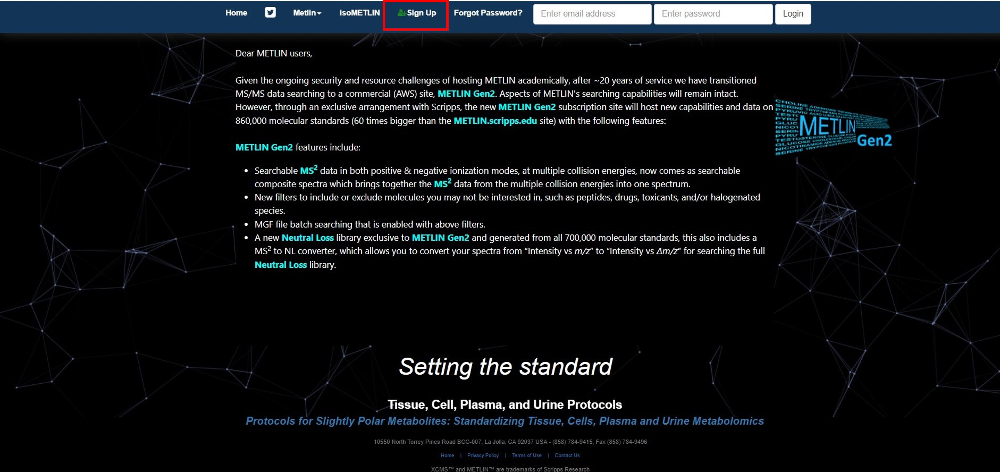

2) Create “New User Registration”
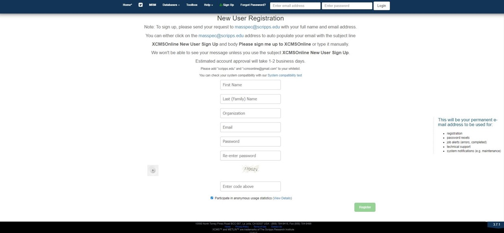

3) Click “Simple Search”
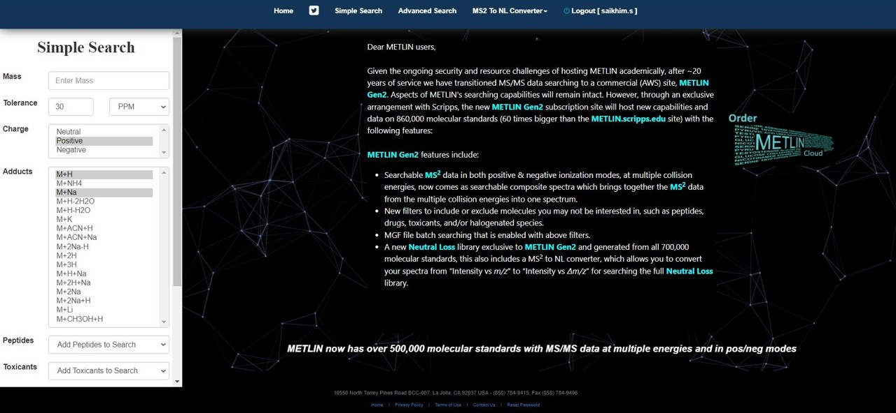

4) Add “m/z” > Set parameter > Click Search
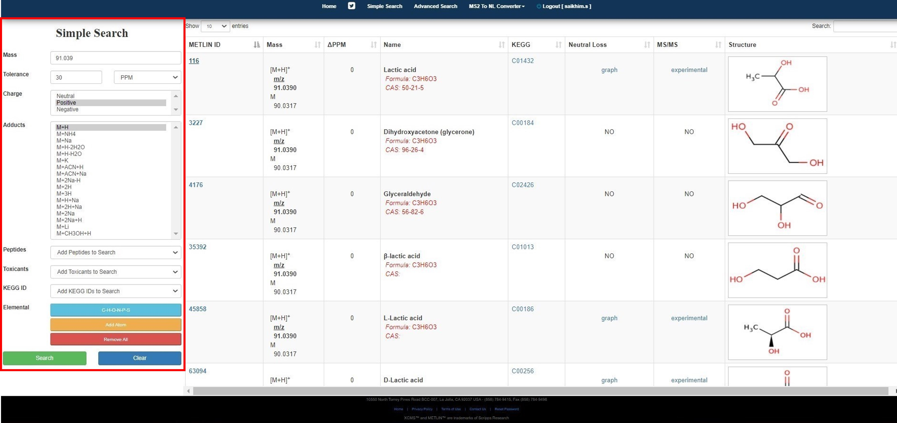

	
---
[↥ **Back to top**](#top)
