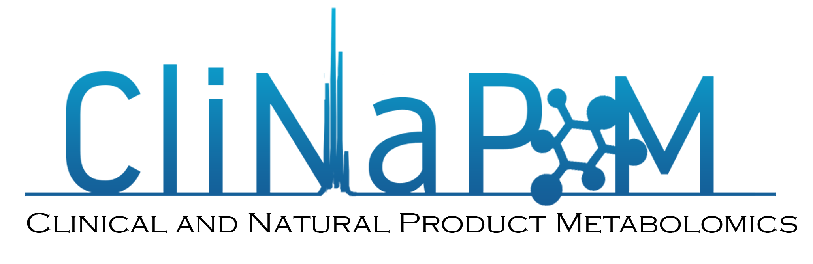
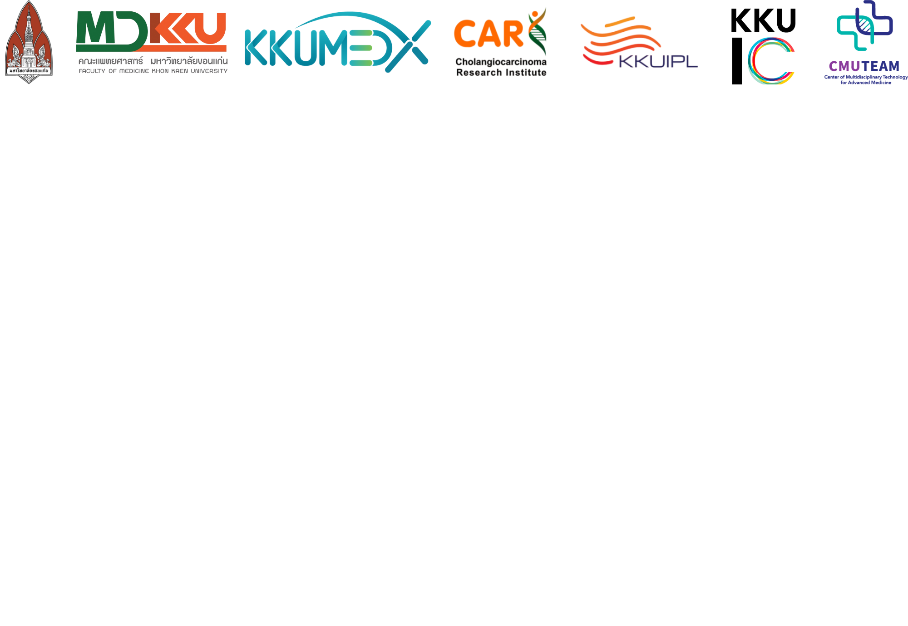
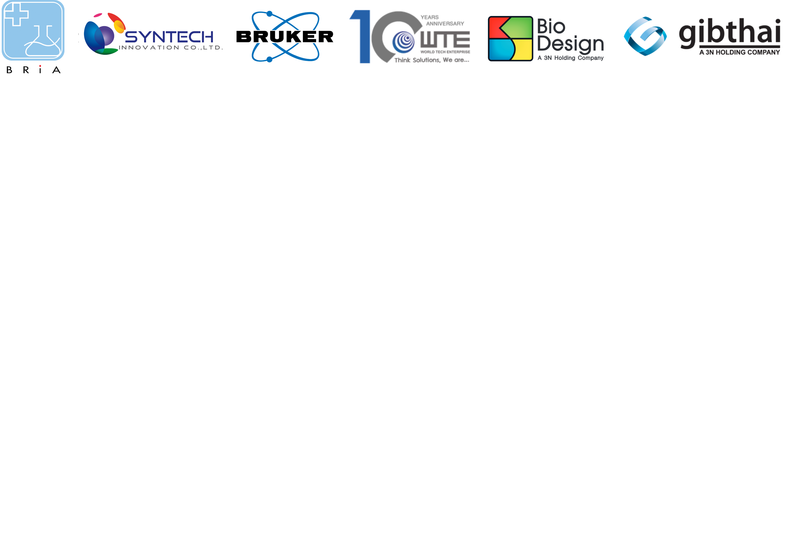

# CliNaP-M (April 2022)

## Course overview

Metabolomics is one of the most renowned and emerging research methodologies in the 21st century that quantitatively and qualitatively measure the level of
metabolites in clinical specimens such as urine, plasma, serum, feces and tissues. It provides systemic understanding of altered biochemical pathways in
response to certain stimuli or conditions. In addition, the biomarkers or fingerprints of particular diseases or medical conditions such as diabetes,
hypertension, some cancers and other metabolic dysregulation-related diseases can effectively be monitored through metabolic profiling. Metabolomics has
been employed in not only clinical research but also natural product studies. Combining metabolomics with pattern recognition, the effectiveness surpasses
the traditional fractionation, which is time-consuming and cost-effective. Therefore, bioactive compounds can be easily identified from crude extracts. 
The Clinical and Natural Product Metabolomics (CliNaP-M) Short Course has been established to gather researchers for catching up the state-of-art
information to the same pace and also to provide a sharing platform in order to put metabolic profiling at ease for everyone.  In the CliNaP-M online Short
Course, attendees will learn all the basic principles in metabolomics and they can then apply their knowledge and understanding in the hands-on sessions
covering how to design metabolomic study, prepare samples, acquire, analyse and interpret metabolomic data with our well experienced instructors in the
field.

### Target audience
The CliNaP-M short course is aimed at researchers at various levels including senior research assistants, PhD students, postdoctoral researchers, 
laboratory scientists, biomedical scientists and clinical scientists.

### Prerequisites
Participants are strongly recommended to attend the online course in Basic Principle of Metabolomics for Clinical and Natural Product Research avialble on
KKUMEDX platform (https://kkumedx.md.kku.ac.th).

### Instructors
[Jutarop Phetcharaburanin](https://www.jutarop.com), Faculty of Medicine, Khon Kaen University

[Poramate Klanrit](https://biochem.md.kku.ac.th/academic-staff/), Faculty of Medicine, Khon Kaen University

[Arporn Wangwiwatsin](https://biochem.md.kku.ac.th/academic-staff/), Faculty of Medicine, Khon Kaen University

[Sivamoke Dissook](https://w2.med.cmu.ac.th/omics/sivamoke/), Faculty of Medicine, Chiang Mai University

[M.L.Manida Suksawat](https://kkuipl.org/executive-committee/), Khon Kaen University International Phenome Laboratory

[Thanaporn Kulthawatsiri](https://kkuipl.org/executive-committee/), Khon Kaen University International Phenome Laboratory

[Suphasarang Sirirattanakul](https://kkuipl.org/executive-committee/), Khon Kaen University International Phenome Laboratory

### Teaching assistants

Suthicha Deewai, Faculty of Medicine, Khon Kaen University

Anyarin Jirahiranpat, Faculty of Medicine, Khon Kaen University

Siriyakorn Kulwong, Faculty of Medicine, Khon Kaen University

Soontaree Ratchatapusit, Faculty of Medicine, Khon Kaen University

Pimpawadee Phukhum, Faculty of Medicine, Khon Kaen University

Saikhim Sringan, Faculty of Medicine, Khon Kaen University

Jittima Tomacha, Faculty of Medicine, Khon Kaen University

Sirinya Sittirak, Faculty of Medicine, Khon Kaen University

Kwuanjira Chaleekan, Faculty of Medicine, Khon Kaen University

Hathaichanok Pradabkam, Faculty of Medicine, Khon Kaen University

Phuc Nguyen Minh Ho, Faculty of Medicine, Khon Kaen University

## Topics and links for course manuals
0. [Planning (experimental design and group work allocation)](1_planning/1_planning_README.md)
1. [Sample preparation](2_sample_preparation/2_sample_preparation_README.md)
2. [Data acquisition](3_data_acquisition/3_data_acquisition_README.md)
3. [Data pre-processing](4_data_preprocessing/4_data_preprocessing_README.md)
4. [Data analysis](5_data_analysis/5_data_analysis_README.md)
5. [Metabolite identification](6_metID/6_metID_README.md)

Additional material
1. [R crashcourse](R_crashcourse/R_crashcourse_README.md)
2. [Software installation guideline](software_installation/software_installation_README.md)
3. [How to download R script from Github](how_to_download_R_script/how_to_download_R_script_README.md)

## Timetable

### Day 1 (3 April 2022)

| Time | Activities |
| ---  |    ---  |
| 11:00-12:00  | Check-in |
| 12:00-13:00 | Lunch |
| 13:00-14:00 | Plenary Lecture (Assoc. Prof Nisana Namwat) |
| 14:00-14:30 | Coffee break + group work announcement (Jutarop) |
| 14:30-15:30 | Session 1: Sample preparation (Manida/Anyarin/Siriyakorn) |
| 15:30-16:30 | Session 2: Data acquisition (Thanaporn/Suthicha/Saikhim) |
| 16:30-17:10 | R crash course (Arporn) |
| 17:10-17:30 | Day 1 Exit Ticket |
| 17:30-18:00 | (Optional) Software installation (Instructor team) | 

### Day 2 (4 April 2022)

| Time | Activities |
| ---  |    ---  |
| 9:00-9:30  | Opening ceremony |
| 9:30-10:00 | Special lecture (KKUIPL) |
| 10:00-10:30 | Coffee break |
| 10:30-12:00 | Session 3: Data pre-processing (Manida/Sivamoke) |
| 12:00-12:45 | Lunch |
| 12:45-13:00 | Sponsor talk |
| 13:00-14:30 | Session 4: Metabolite identification I (Jutarop/Thanaporn) |
| 14:30-15:00 | Coffee break | 
| 15:00-16:30 | Session 4: Metabolite identification II (Jutarop/Thanaporn) |
| 16:30-17:00 | Day 2 Exit Ticket |
| 17:00 onward | Reception dinner + Special lecture (Asst. Prof. Chavis Ketkaew) |

### Day 3 (5 April 2022)

| Time | Activities |
| ---  |    ---  |
| 9:00-9:30  | Special lecture (Dr. Bundit Promraksa) |
| 9:30-10:30 | Session 5: Data analysis I (Arporn/Poramate/Jutarop/Phuc) |
| 10:30-11:00 | Coffee break |
| 11:00-12:00 | Session 5: Data analysis II (Arporn/Poramate/Jutarop/Phuc) |
| 12:00-12:45 | Lunch |
| 12:45-13:00 | Sponsor talk |
| 13:00-15:00 | Prepare for group presentation |
| 15:00-15:30 | Coffee break | 
| 15:30-16:30 | Group presentation |
| 16:30-16:50 | Day 3 Exit Ticket and further disussion |
| 16:50-17:00 | Closing ceremony |

## Organising team

## Our kind sponsors 

---

