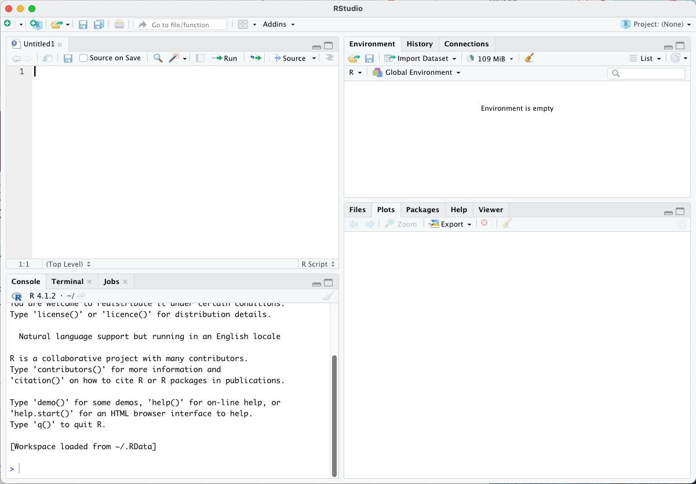
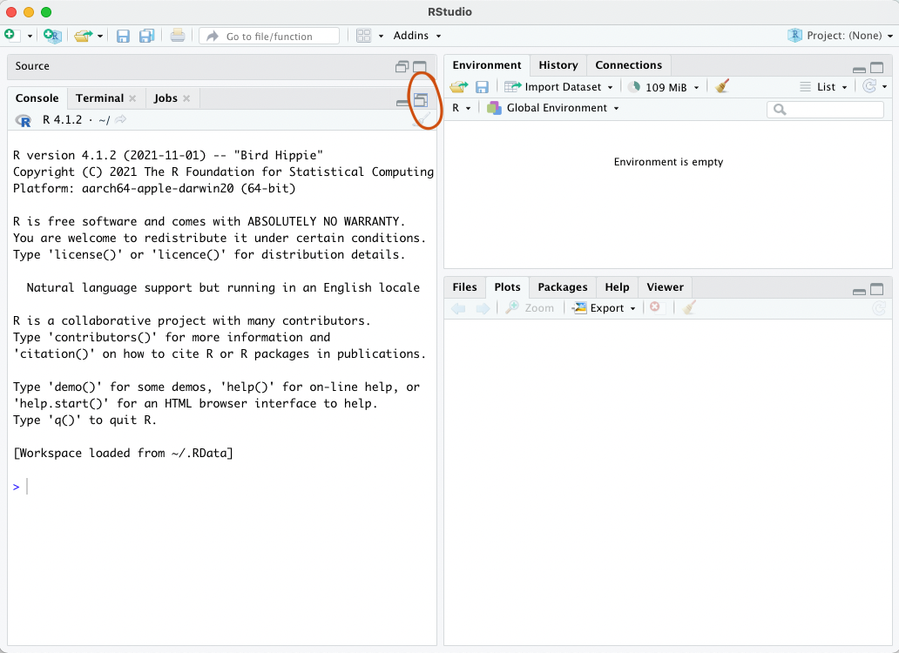
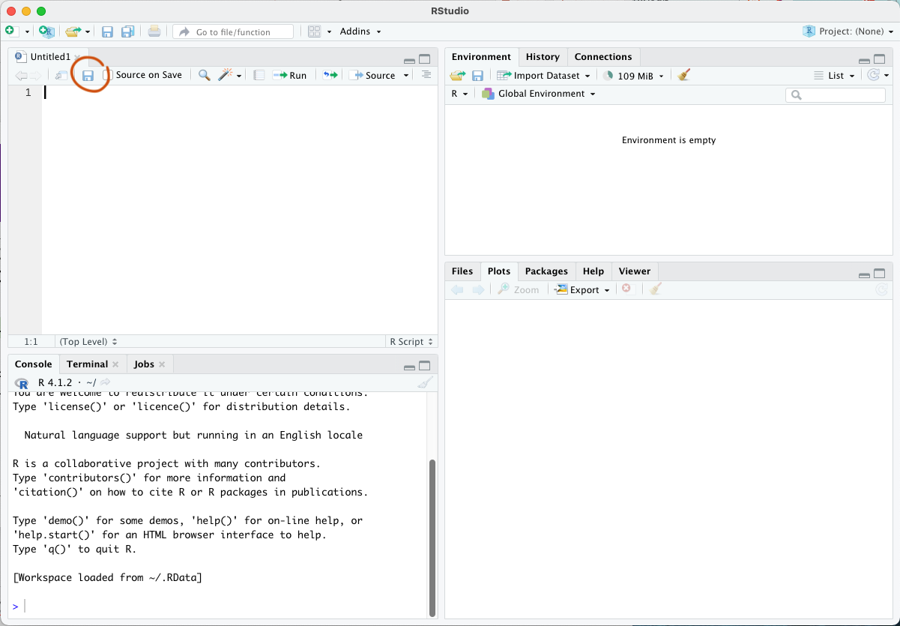
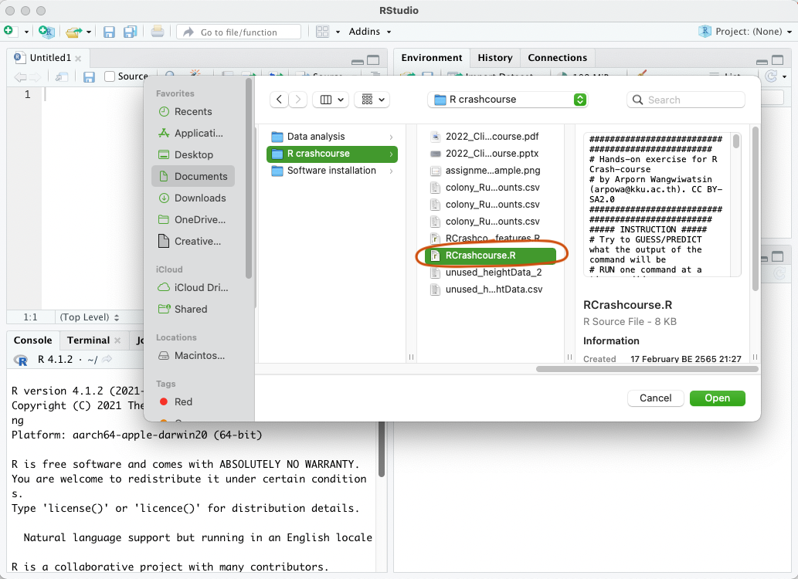
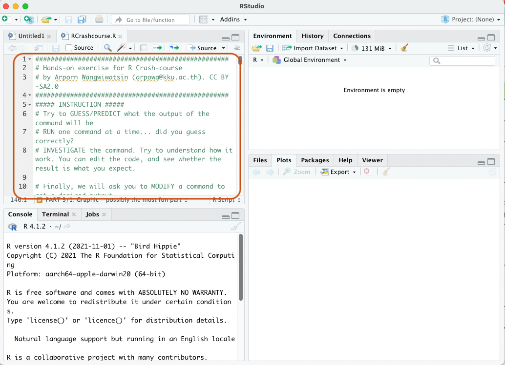
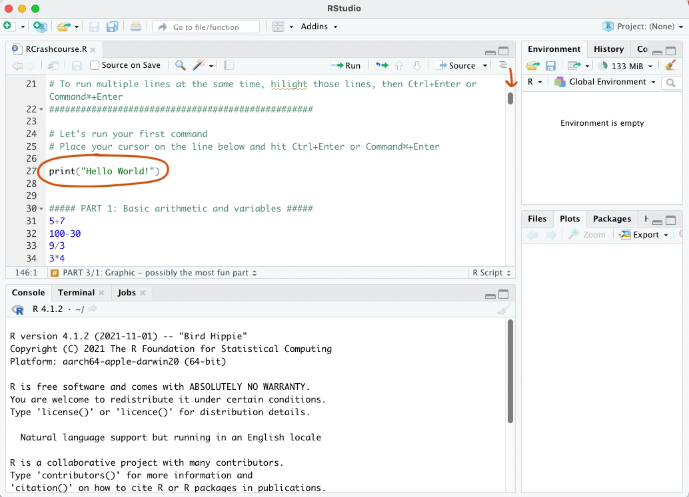
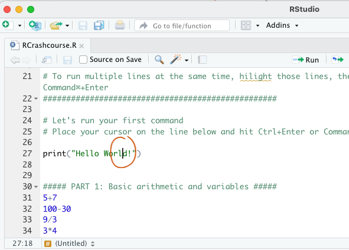
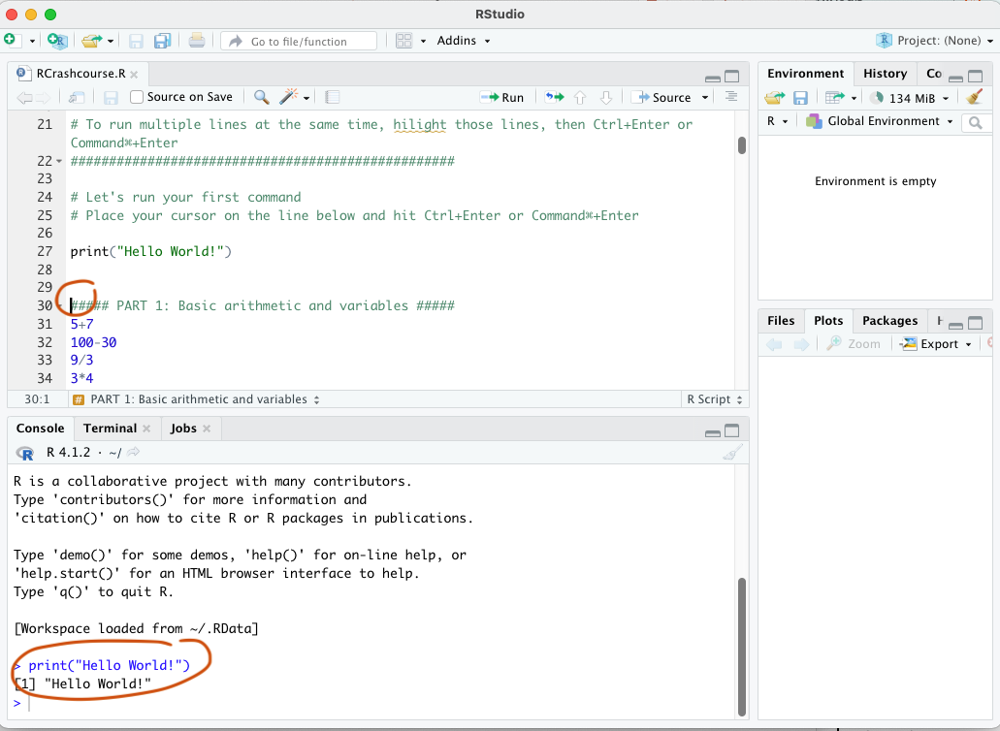

# R crash-course
In this session, you will be introduced to R programming. R is a computer language and work on command line tools. We can use R on a plain command line window or we can use it on RStudio IDE (Integrated Development Environment i.e. a software that provide friendlier environment for writting code!). RStudio provide additional features such as code syntax hilight (make your code easier to read and to spot errors), space to view and manipulate plots, and useful interface such as command history tab and environment tab that list your object, dataset, functions etc.

For metabolomics, we can use R for data pre-processing and data analysis for both NMR and LC-MS data. In this CliNaP-M workshop, however, we will use R for NMR data only, to introduce you to a variety of tools and approach for metabolomics data processing. 

## Table of Contents
1. [Getting started with R in RStudio](#start)
2. [Hands-on](#handson)
3. [Exercise](#exercise)

## Getting started with R in RStudio <a name="start"></a>
If you are using your own computer, R and RStudio may need to be installed first. The installation guide is provided [here](#).

For this workshop, we will use RStudio. When you open it, the window should look like this.


In some cases, the top window (script window) is hidden away. Just click on the button below to reveal the script window.


We provide a script for you to learn R. Open the provided script by clicking the "Open" symbol. If you don't have the script already, you can download from [here](#).


Navigate to the folder where your script is kept, choose the file and click "Open". 


To use this script, read the green text carefully. The text explain steps that you should follow and questions that you should attempt to answer before moving on to the next command. 


Keep reading and scrolling down. You will meet your first command! 


To run a command in RStudio, place cursor anywhere on that line IN THE SCRIPT WINDOW (top window). Then, hit 'Ctrl + Enter' for Windows or 'Command + Enter' for Mac. 
There is no need to re-write or copy the command into the console (bottom window). 


The command that was run will appear in the console (bottom window) as well as any on-screen output.


Notice how the command in R look like. The name of the command (also-known-as "function") is followed by a round bracket (). Inside the round bracker is/are input(s) for the commands. Go through the provided script to see the variety and variation of R command syntax (i.e. grammar) 

## Hands-on <a name="handson"></a>
Now, please continue with the provided R script. Remember that you should

- Guess/Predict the outcome of each command before you hit Ctrl + Enter
- Run the command then look at the output
- Is it what you expect? Try to investigate how the command work. 

Did you lost the R script? Download it again [here](#)

## Exercise <a name="exercise"></a>
Before we go, try to produce the following plot using the script provided. (This script is also provided at the end of your `RCrashcourse.R` script)


```r
data <- c(1,3,5,6,7,8,10,6,4,2)
___plot(height = data, names.arg = c(___,___,___,___,___,___,___,___,___,___),
        col = rainbow(____),
        ____ = "CliNaP-M Day 1",
        ____ = "______ _____")
```


