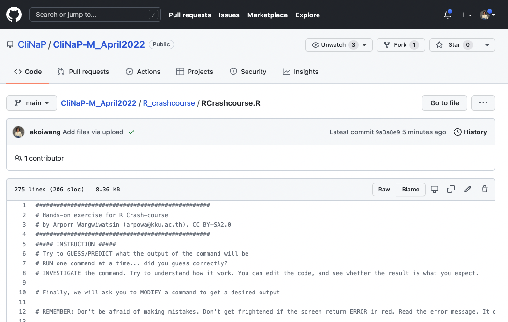
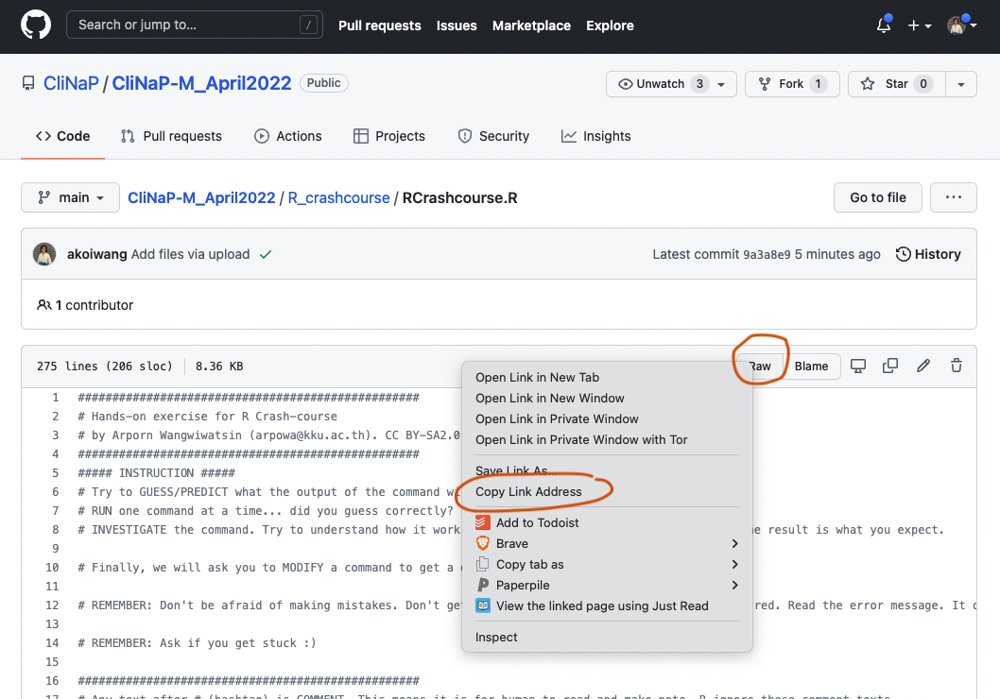

# How to download R script from Github (file ends with .R)

1. Click the file name. You will enter a window that looks like this.

2. **Rigth click** on the button that say **Raw** and choose **Save link as...**

3. Choose the location on your computer where you want to keep this file. 

